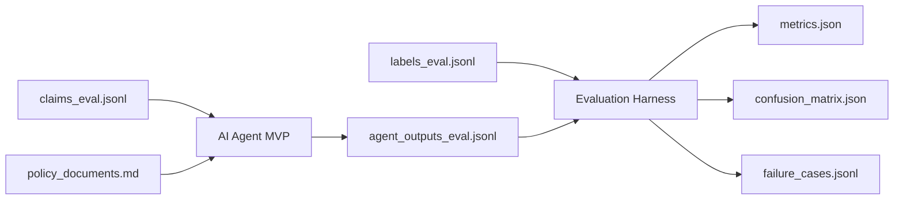

# Evaluation Guide

Version: 1.0.0

This document defines how to evaluate an AI Agent MVP built from this Template.

The Agent must be evaluated with synthetic data generated by `data_generator` before any real or pseudonymized data is considered.

## 1. Evaluation Boundary

Agent input:

```text
data_generator/generated/policy_documents.md
data_generator/generated/claims_eval.jsonl
```

Evaluation-only labels:

```text
data_generator/generated/labels_eval.jsonl
```

The Agent runtime must never read `labels_eval.jsonl`. The evaluation harness reads labels only after Agent output is produced.

## 2. Evaluation Flow



## 3. Required Evaluation Files

Expected evaluation input:

```text
data_generator/generated/claims_eval.jsonl
data_generator/generated/labels_eval.jsonl
ai_agent_template/eval/thresholds.yaml
```

Expected Agent output:

```text
ai_agent_template/eval/reports/{run_id}/agent_outputs_eval.jsonl
```

Expected evaluation output:

```text
ai_agent_template/eval/reports/{run_id}/metrics.json
ai_agent_template/eval/reports/{run_id}/confusion_matrix.json
ai_agent_template/eval/reports/{run_id}/failure_cases.jsonl
ai_agent_template/eval/reports/{run_id}/evaluation_result.json
```

## 4. Pass/Fail Policy

An evaluation run passes only when:

- every required metric is present
- every hard threshold passes
- `schema_validity` is exactly `1.0`
- no critical failure category is present

Critical failure categories:

- invalid JSON output
- schema-invalid output
- label leakage
- final-decision wording in reviewer-facing output
- human review miss on fraud-suspected cases

## 5. Metric Groups

Metric details are defined in:

```text
ai_agent_template/eval/metrics.md
```

Thresholds are defined in:

```text
ai_agent_template/eval/thresholds.yaml
```

## 6. Minimum MVP Gate

Synthetic-data MVP gate:

```text
schema_validity = 1.0
decision_accuracy >= 0.90
coverage_accuracy >= 0.95
payable_amount_exact_match >= 0.95
missing_document_exact_match >= 0.95
human_review_recall >= 0.98
fraud_suspected_recall >= 0.98
false_denial_rate <= 0.01
human_review_miss_rate <= 0.01
```

These are not production approval criteria. They are minimum gates for continuing from Agent MVP to deeper validation.

## 7. Failure Case Review

Every failed case must include:

- `claim_id`
- expected decision
- actual decision
- mismatch category
- recommended remediation
- whether the case is safety-critical

Safety-critical examples:

- Agent recommends `deny` when expected decision is `pay` or `partial_pay`
- Agent recommends payable decision when expected decision is `deny`
- Agent misses mandatory `human_review`
- Agent misses `fraud_suspected`

## 8. Model Change Regression

Whenever model provider, model ID, prompt, workflow, schema, or tool contract changes, run the same evaluation dataset again and compare:

- previous metrics
- new metrics
- pass/fail status
- new failure cases
- fixed failure cases

Model changes must not reduce hard-gate metrics below thresholds.
