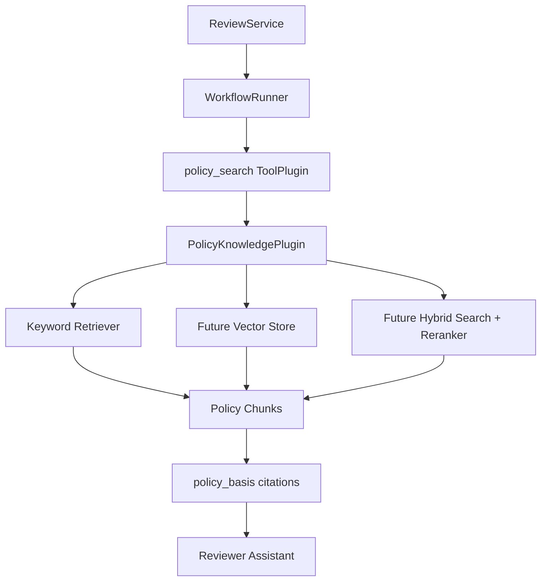

# RAG-Ready Design Guide

## 1. 목적

이 문서는 보험 청구 자동 심사 AI Agent Template에 RAG를 바로 운영 도입하지 않더라도, 이후 실제 약관과 청구 문서 검색 계층을 안전하게 연결할 수 있도록 필요한 계약과 설계 기준을 정의한다.

현재 Template은 synthetic 약관과 구조화 상품 데이터를 사용한다. RAG-ready 보완의 목적은 다음과 같다.

- `policy_search`를 단순 문서 검색에서 약관 retrieval adapter로 확장 가능하게 한다.
- 실제 vector DB, hybrid search, reranker 도입 전에도 동일 schema로 테스트할 수 있게 한다.
- 약관 근거를 `clause_id`, `citation_id`, `retrieval_score`로 추적할 수 있게 한다.
- 검색 실패, 낮은 검색 신뢰도, citation 불명확 상황에서 `human_review`로 안전하게 보낼 수 있게 한다.
- 청구 데이터 retrieval과 정답 라벨 leakage를 분리한다.

## 2. 범위

### 2.1 포함

- retrieval request/result JSON Schema
- policy chunk JSON Schema
- `PolicyKnowledgePlugin` interface
- SDK keyword retriever
- synthetic policy knowledge plugin
- `policy_search` tool contract의 optional RAG metadata
- Agent output `policy_basis`의 optional citation metadata

### 2.2 제외

- 실제 vector DB 구축
- embedding model 운영
- 대규모 문서 ingestion pipeline
- 실제 보험사 약관 자동 파싱
- 실제 고객 청구 문서 OCR 또는 이미지 위변조 탐지
- 정답 라벨 기반 retrieval

## 3. RAG 적용 대상

보험 심사에서는 RAG를 두 영역으로 분리한다.

```text
1. Policy RAG
   약관, 특약, 지급기준, 면책조항, 심사지침 검색

2. Claim Retrieval
   과거 유사 청구, 반복 패턴, 병원/진료/서류 패턴, 심사 이력 조회
```

초기 RAG-ready 범위는 `Policy RAG`에 집중한다. `Claim Retrieval`은 개인정보, 민감정보, 라벨 leakage, 행동 패턴 분석 이슈가 있으므로 MVP 이후 별도 fraud/behavior feature store와 함께 설계한다.

## 4. 권장 아키텍처



MVP 또는 Starter Kit에서는 dependency-free `KeywordPolicyRetriever`를 사용한다. 실제 보험사 적용 시에는 같은 `PolicyKnowledgePlugin` interface를 구현하는 vector/hybrid retriever로 교체한다.

## 5. Schema

### 5.1 Policy Chunk

파일:

```text
ai_agent_template/schemas/policy_chunk.schema.json
```

핵심 필드:

- `chunk_id`: chunk 고유 ID
- `source`: 원천 문서 또는 구조화 데이터 이름
- `section`: 조항 또는 담보명
- `text`: 검색 대상 원문
- `summary`: 심사자에게 보여줄 요약
- `product_id`
- `product_version`
- `effective_date`
- `coverage_code`
- `clause_id`

### 5.2 Retrieval Request

파일:

```text
ai_agent_template/schemas/retrieval_request.schema.json
```

예:

```json
{
  "query": "outpatient noncovered deductible limit",
  "top_k": 3,
  "retrieval_mode": "keyword",
  "filters": {
    "product_id": "SYN-MED-001",
    "effective_date": "2026-01-01"
  }
}
```

### 5.3 Retrieval Result

파일:

```text
ai_agent_template/schemas/retrieval_result.schema.json
```

예:

```json
{
  "query": "outpatient noncovered deductible limit",
  "matches": [
    {
      "chunk_id": "PRODUCT-COVERAGE-002",
      "source": "products.json",
      "section": "비급여 통원 의료비",
      "summary": "비급여 통원 의료비 coverage rule from structured product data.",
      "text": "coverage_code=COV_OUTPATIENT_NONCOVERED ...",
      "product_id": "SYN-MED-001",
      "product_version": "1.0.0",
      "effective_date": "2026-01-01",
      "coverage_code": "COV_OUTPATIENT_NONCOVERED",
      "clause_id": "COVERAGE-002",
      "citation_id": "products.json#COVERAGE-002",
      "retrieval_score": 0.75,
      "retrieval_method": "keyword"
    }
  ]
}
```

## 6. Plugin Interface

파일:

```text
ai_agent_template/developer_kit/plugin_interface/knowledge_retriever_plugin.py
```

Interface:

```python
class PolicyKnowledgePlugin(Protocol):
    name: str
    version: str
    owner: str
    retrieval_modes: list[str]

    def retrieve(
        self,
        request: dict[str, Any],
        context: dict[str, Any] | None = None,
    ) -> dict[str, Any]:
        ...
```

Conformance:

```text
PolicyKnowledgePluginConformance
```

이 conformance는 retrieval request와 retrieval result가 schema를 만족하는지 검증한다.

## 7. SDK 구현

파일:

```text
ai_agent_template/developer_kit/sdk/claim_agent_sdk/retrieval.py
```

제공 기능:

- `PolicyChunk`
- `KeywordPolicyRetriever`
- `KeywordPolicyRetriever.from_template(template)`
- `retrieve(request, context)`

`KeywordPolicyRetriever`는 실제 운영용 RAG가 아니다. vector DB 없이 RAG-ready contract와 workflow 연결을 검증하기 위한 기본 구현이다.

## 8. Workflow 연동

`WorkflowRunner`는 optional `policy_retriever`를 받을 수 있다.

```python
runner = WorkflowRunner(
    template,
    tool_registry=registry,
    policy_retriever=KeywordPolicyRetriever.from_template(template),
)
```

`policy_retriever`가 제공되면 `policy_search` plugin은 retrieval result를 사용한다. 제공되지 않거나 검색 결과가 없으면 기존 synthetic fallback을 사용한다.

## 9. Output Citation

`claim_review_output.schema.json`의 `policy_basis`는 기존 필드와 optional RAG metadata를 함께 지원한다.

필수:

- `source`
- `section`
- `summary`

Optional:

- `chunk_id`
- `product_id`
- `product_version`
- `effective_date`
- `coverage_code`
- `clause_id`
- `citation_id`
- `retrieval_score`
- `retrieval_method`

기존 output은 계속 유효하다.

## 10. 안전 원칙

- RAG 결과는 지급액 계산의 source of truth가 아니다.
- 지급액은 계속 `payable_calculator` tool 결과만 사용한다.
- 검색 결과가 없거나 낮은 confidence인 경우 `human_review`로 보낸다.
- citation이 없는 약관 근거는 reviewer-facing output에서 명확히 표시한다.
- 정답 라벨 파일은 retrieval index에 포함하지 않는다.
- 실제 고객 개인정보와 원문 청구 문서는 비식별화/권한/보관기간 기준 없이 index에 넣지 않는다.
- vector search 결과는 반드시 product/version/effective_date filter로 제한한다.

## 11. 실제 RAG로 전환할 때

전환 순서:

1. 실제 약관 원문 수집
2. 조항 단위 chunking
3. `clause_id`, `product_id`, `product_version`, `effective_date` 부여
4. 사람 검수
5. embedding 생성
6. vector store 또는 hybrid search adapter 구현
7. `PolicyKnowledgePluginConformance` 통과
8. synthetic eval 회귀 테스트
9. 실제 검증셋 평가
10. reviewer UAT

교체 대상:

```text
KeywordPolicyRetriever
-> InsurerHybridPolicyRetriever
```

유지 대상:

```text
retrieval_request.schema.json
retrieval_result.schema.json
claim_review_output.policy_basis
policy_search tool contract
WorkflowRunner optional policy_retriever
```

## 12. 테스트 기준

필수 테스트:

- retrieval schema validation
- `PolicyKnowledgePluginConformance`
- `policy_search` contract validation
- workflow output schema validation
- citation metadata 보존
- retriever 미주입 시 기존 synthetic fallback 유지
- Starter Kit smoke test 통과

실행:

```powershell
python -m unittest discover -s ai_agent_template\tests
python -m unittest discover -s ai_agent_template\developer_kit\sdk\tests
python -m unittest discover -s ai_agent_template\developer_kit\plugin_interface\tests
python -m unittest discover -s ai_agent_template\developer_kit\starter_kit\tests
```

