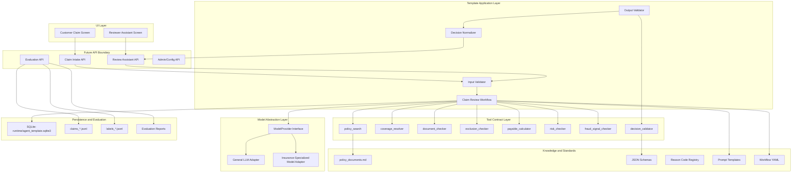
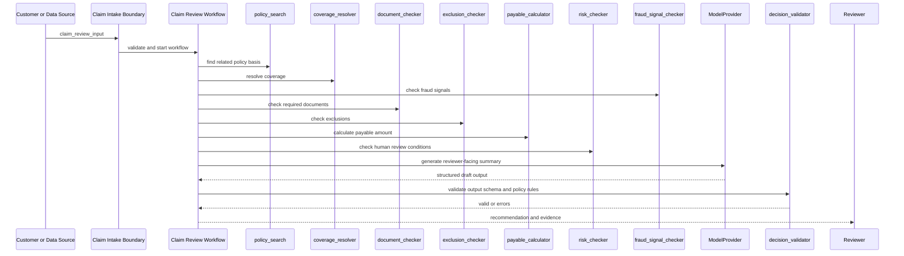
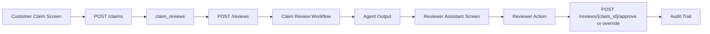
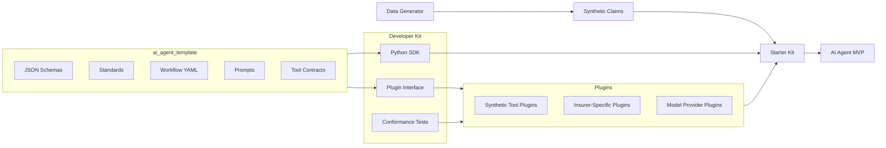

# Technical Specification: Insurance Claims Review AI Agent Template

## 1. 목적

이 문서는 `ai_agent_template/docs/PRD.md`를 기준으로 보험 청구 자동 심사 AI Agent Template의 구현 설계를 정의한다. Template은 실제 AI Agent MVP가 아니라, MVP 개발 전에 고정해야 할 표준 산출물의 구조, 입력/출력 계약, 도구 계약, 화면 경계, 평가 기준, 모델 교체 방식, 저장소 구조, 향후 API 정의서의 기반을 제공한다.

초기 대상은 `data_generator`에서 생성한 실손형 의료보험 합성 데이터다. 실제 데이터 적용 전까지 Template은 심사자 보조 의견 생성을 위한 설계 표준으로만 사용한다.

## 2. 핵심 제약

- 모든 Template 산출물은 `ai_agent_template/` 하위에 둔다.
- Agent는 심사자 보조 의견과 최종 지급 결정 권고안을 제시하되, 실제 보험금 지급을 확정하지 않는다.
- Agent 입력에는 정답 라벨이 포함되지 않는다.
- 지급액 계산, 필수서류 확인, 면책 판단, 사람 심사 조건은 tool contract를 통해 수행하도록 설계한다.
- DB가 필요하면 SQLite를 사용한다.
- 기본 SQLite 파일명은 `ai_agent_template/runtime/agent_template.sqlite3`로 한다.
- Docker는 우선 사용하지 않는다. 향후 배포 단계에서만 `Dockerfile`과 compose 구성을 별도 설계한다.
- 모델은 교체 가능해야 하며, 향후 보험 특화 모델을 적용할 수 있도록 provider abstraction을 둔다.
- 사용자 화면은 일반 사용자의 청구 화면과 보험 심사자의 assistant 화면으로 분리한다.
- 향후 API 정의서는 이 문서의 endpoint, DTO, schema, error code 기준을 기반으로 작성한다.

## 3. 전체 아키텍처



## 4. 레이어별 책임

### 4.1 UI Layer

UI는 두 화면군으로 분리한다.

`Customer Claim Screen`

- 일반 사용자가 보험금 청구 정보를 입력하거나 업로드하는 화면이다.
- MVP 초기에는 합성 데이터 claim JSON을 불러와 청구 입력 화면을 시뮬레이션할 수 있다.
- 사용자는 Agent 정답이나 내부 라벨을 볼 수 없다.

`Reviewer Assistant Screen`

- 보험 심사자가 청구건별 Agent 보조 의견을 확인하는 화면이다.
- 심사자는 권고 결정, 지급예상금액, 누락서류, 면책 사유, 사람 심사 사유, 약관 근거를 확인한다.
- 심사자는 Agent 의견을 승인, 수정, 반려, 보류할 수 있다.
- 실제 최종 지급 결정 권한은 심사자 또는 기존 심사 시스템에 있다.

### 4.2 Future API Boundary

Template 단계에서는 API를 구현하지 않아도 되지만, API 정의서 작성을 위한 경계를 미리 둔다.

- Claim Intake API: 청구 접수 및 입력 검증
- Review Assistant API: Agent 심사 의견 생성 및 조회
- Evaluation API: Agent 출력과 정답 라벨 비교
- Admin/Config API: 모델, threshold, reason code, prompt 버전 관리

### 4.3 Template Application Layer

- 입력 JSON schema validation
- 판단 workflow 실행
- tool contract 호출 순서 정의
- 모델 호출 prompt 구성
- 출력 JSON schema validation
- reason code 표준화
- human review 강제 조건 적용
- 심사자 보조 문구 생성

### 4.4 Tool Contract Layer

Tool은 MVP에서 실제 구현될 기능의 계약이다. Template 단계에서는 schema와 호출 규칙을 정의한다.

LLM이 직접 처리하지 않고 tool로 분리해야 하는 영역:

- 지급액 계산
- 한도 및 자기부담금 적용
- 필수서류 누락 확인
- 날짜 비교
- 계약 상태 확인
- 면책 플래그 판단
- 사람 심사 조건 판단
- 중복 영수증 탐지
- 출력 JSON 검증

### 4.5 Model Abstraction Layer

모델은 직접 코드에 고정하지 않는다.

기본 인터페이스:

```text
ModelProvider.generate_review(prompt, context, output_schema) -> model_response
```

초기 adapter:

- `GeneralLLMProvider`: 범용 LLM 연결용
- `MockModelProvider`: 테스트와 schema 검증용

향후 adapter:

- `InsuranceSpecializedProvider`: 보험 특화 모델 연결용
- `OnPremModelProvider`: 내부망 모델 연결용
- `HybridProvider`: 룰 기반 결과와 LLM 설명 생성을 분리하는 조합형 provider

## 5. 상세 처리 흐름



우선순위:

```text
1. fraud 또는 duplicate signal -> human_review
2. 계약 실효 또는 보장기간 외 -> deny 권고
3. 필수서류 누락 -> request_documents 권고
4. 명확한 면책 조건 -> deny 권고
5. 고액, 반복청구, 문서 불일치 -> human_review
6. 한도 초과 또는 자기부담금 적용 -> partial_pay 또는 pay
7. 정상 보장 -> pay 권고
```

`human_review` 조건은 다른 자동 권고보다 우선한다. 단, 계약 실효나 보장기간 외처럼 명확한 부지급 사유가 있어도 고위험 신호가 동반되면 reviewer note에 해당 위험 신호를 함께 남긴다.

## 6. 디렉터리 구조

`ai_agent_template/` 하위 구조는 다음과 같이 설계한다.

```text
ai_agent_template/
  docs/
    PRD.md
    TECH_SPEC.md
    API_SPEC_DRAFT.md
    EVALUATION.md
    STANDARDIZATION.md
    CONFIGURATION.md
  prompts/
    system_prompt.md
    claim_review_prompt.md
    output_format_prompt.md
    human_review_policy_prompt.md
  schemas/
    claim_review_input.schema.json
    claim_review_output.schema.json
    tool_contracts.schema.json
    evaluation_result.schema.json
    api_error.schema.json
  workflows/
    claim_review_workflow.yaml
    human_review_rules.yaml
  standards/
    reason_codes.yaml
    decision_codes.yaml
    document_codes.yaml
    coverage_codes.yaml
    field_naming.md
  tools/
    contracts/
      policy_search.contract.json
      coverage_resolver.contract.json
      document_checker.contract.json
      exclusion_checker.contract.json
      payable_calculator.contract.json
      risk_checker.contract.json
      fraud_signal_checker.contract.json
      decision_validator.contract.json
  examples/
    customer_claim_input.example.json
    reviewer_assistant_output.example.json
    api_review_request.example.json
    api_review_response.example.json
  eval/
    metrics.md
    evaluation_plan.md
    thresholds.yaml
  ui/
    customer_claim_screen.md
    reviewer_assistant_screen.md
  api/
    endpoints.md
    dto.md
    errors.md
  db/
    schema.sql
    migrations/
      001_initial.sql
  runtime/
    agent_template.sqlite3
    .gitkeep
  tests/
    schema_validation_cases.md
    workflow_validation_cases.md
```

주의:

- `runtime/agent_template.sqlite3`는 로컬 개발용 DB 파일이다.
- 실제 운영 데이터, 개인정보, 민감정보를 이 DB에 저장하지 않는다.
- Docker 관련 파일은 현재 생성하지 않는다.

## 7. SQLite 설계

DB를 구축할 경우 SQLite를 사용한다.

기본 DB 파일:

```text
ai_agent_template/runtime/agent_template.sqlite3
```

초기 schema 파일:

```text
ai_agent_template/db/schema.sql
```

초기 migration:

```text
ai_agent_template/db/migrations/001_initial.sql
```

### 7.1 테이블 설계

`claim_reviews`

```sql
CREATE TABLE claim_reviews (
  id INTEGER PRIMARY KEY AUTOINCREMENT,
  claim_id TEXT NOT NULL UNIQUE,
  policy_id TEXT NOT NULL,
  product_id TEXT NOT NULL,
  input_payload_json TEXT NOT NULL,
  status TEXT NOT NULL,
  created_at TEXT NOT NULL,
  updated_at TEXT NOT NULL
);
```

`agent_outputs`

```sql
CREATE TABLE agent_outputs (
  id INTEGER PRIMARY KEY AUTOINCREMENT,
  claim_id TEXT NOT NULL,
  output_payload_json TEXT NOT NULL,
  recommended_decision TEXT NOT NULL,
  recommended_payable_amount INTEGER NOT NULL,
  coverage_code TEXT NOT NULL,
  requires_human_review INTEGER NOT NULL,
  fraud_suspected INTEGER NOT NULL,
  confidence REAL NOT NULL,
  prompt_version TEXT NOT NULL,
  model_provider TEXT NOT NULL,
  model_name TEXT NOT NULL,
  created_at TEXT NOT NULL,
  FOREIGN KEY (claim_id) REFERENCES claim_reviews(claim_id)
);
```

`tool_call_logs`

```sql
CREATE TABLE tool_call_logs (
  id INTEGER PRIMARY KEY AUTOINCREMENT,
  claim_id TEXT NOT NULL,
  tool_name TEXT NOT NULL,
  request_json TEXT NOT NULL,
  response_json TEXT,
  status TEXT NOT NULL,
  error_code TEXT,
  duration_ms INTEGER,
  created_at TEXT NOT NULL,
  FOREIGN KEY (claim_id) REFERENCES claim_reviews(claim_id)
);
```

`evaluation_runs`

```sql
CREATE TABLE evaluation_runs (
  id INTEGER PRIMARY KEY AUTOINCREMENT,
  run_id TEXT NOT NULL UNIQUE,
  dataset_name TEXT NOT NULL,
  claims_path TEXT NOT NULL,
  labels_path TEXT NOT NULL,
  output_path TEXT NOT NULL,
  metrics_json TEXT NOT NULL,
  passed INTEGER NOT NULL,
  created_at TEXT NOT NULL
);
```

`config_versions`

```sql
CREATE TABLE config_versions (
  id INTEGER PRIMARY KEY AUTOINCREMENT,
  config_type TEXT NOT NULL,
  version TEXT NOT NULL,
  file_path TEXT NOT NULL,
  checksum TEXT NOT NULL,
  active INTEGER NOT NULL,
  created_at TEXT NOT NULL
);
```

### 7.2 DB 사용 원칙

- Template 단계에서 DB는 optional이다.
- DB는 API 정의와 MVP 구현을 위한 로컬 상태 저장소로만 사용한다.
- 원본 청구 JSON과 Agent 출력 JSON은 TEXT 컬럼에 저장한다.
- schema version, prompt version, model provider, model name을 함께 기록한다.
- 평가 결과는 재현성을 위해 dataset path와 metrics를 함께 저장한다.

## 8. Docker 정책

현재는 Docker를 사용하지 않는다.

현재 개발 방식:

```text
local filesystem
Python runtime if needed
SQLite optional
Markdown/JSON/YAML template artifacts
```

향후 Docker 적용 시 별도 산출물:

```text
Dockerfile
docker-compose.yml
.dockerignore
docs/DEPLOYMENT.md
```

Docker 적용 전 검토할 항목:

- 모델 API credential 주입 방식
- SQLite 볼륨 경로
- 로그 보관 위치
- 개인정보 포함 가능 데이터의 컨테이너 외부 반출 통제
- 내부망 모델 또는 보험 특화 모델 접근 방식

## 9. API 정의서 토대

향후 `ai_agent_template/docs/API_SPEC.md` 또는 `ai_agent_template/docs/API_SPEC_DRAFT.md`를 작성할 때 아래 구조를 따른다.

### 9.1 API 그룹

```text
Claims API
- POST /claims
- GET /claims/{claim_id}

Review API
- POST /reviews
- GET /reviews/{claim_id}
- POST /reviews/{claim_id}/rerun

Reviewer Action API
- POST /reviews/{claim_id}/approve
- POST /reviews/{claim_id}/override
- POST /reviews/{claim_id}/request-human-review

Evaluation API
- POST /evaluations/runs
- GET /evaluations/runs/{run_id}

Config API
- GET /configs/model
- PUT /configs/model
- GET /standards/reason-codes
```

### 9.2 핵심 DTO

`ClaimReviewRequest`

```json
{
  "claim": "claim_review_input",
  "policy_document_ref": "string",
  "options": {
    "model_provider": "string",
    "model_name": "string",
    "strict_schema": true,
    "force_human_review": false
  }
}
```

`ClaimReviewResponse`

```json
{
  "request_id": "string",
  "claim_id": "string",
  "status": "completed | failed | human_review_required",
  "agent_output": "claim_review_output",
  "tool_trace": [
    {
      "tool_name": "string",
      "status": "success | failed",
      "duration_ms": "integer"
    }
  ],
  "errors": []
}
```

`ApiError`

```json
{
  "error_code": "string",
  "message": "string",
  "details": {},
  "retryable": false
}
```

### 9.3 공통 API 규칙

- 모든 요청/응답은 JSON이다.
- 날짜는 `YYYY-MM-DD` 또는 ISO-8601 datetime을 사용한다.
- 금액은 KRW 정수로 표현한다.
- boolean은 문자열이 아니라 JSON boolean을 사용한다.
- schema validation 실패 시 `VALIDATION_ERROR`를 반환한다.
- tool 실패 시 Agent는 가능한 경우 `human_review` 권고로 fallback한다.

## 10. 입력 표준

입력 schema 파일:

```text
ai_agent_template/schemas/claim_review_input.schema.json
```

입력은 Data Generator의 `claims_*.jsonl` 한 라인과 호환되어야 한다.

### 10.1 필수 입력 필드

```text
claim_id
policy_id
product_id
scenario_type
claimant.synthetic_person_id
claimant.age
claimant.gender
policy.status
policy.coverage_start_date
policy.coverage_end_date
claim.care_setting
claim.benefit_category
claim.treatment_code
claim.diagnosis_code
claim.incident_date
claim.treatment_start_date
claim.treatment_end_date
claim.claim_date
claim.claimed_amount
claim.receipt_id
claim.provider_type
documents
claim_history.same_diagnosis_claims_90d
claim_history.manual_therapy_count_180d
claim_history.prior_receipt_ids
signals
```

### 10.2 입력 validation 규칙

- `claim_id`, `policy_id`, `product_id`는 non-empty string이다.
- `claimed_amount`는 0 이상의 integer다.
- `coverage_start_date <= coverage_end_date`여야 한다.
- `incident_date`, `treatment_start_date`, `treatment_end_date`, `claim_date`는 ISO date다.
- `treatment_start_date <= treatment_end_date`여야 한다.
- `documents`는 string array다.
- `prior_receipt_ids`는 string array다.
- 정답 라벨 필드가 포함되면 validation error다.

정답 라벨 금지 필드:

```text
expected_decision
expected_payable_amount
expected_explanation
reason_codes
calculation
requires_human_review
fraud_suspected
```

단, `signals.fraud_suspected`처럼 향후 입력 signal로 정의된 필드는 별도 schema version에서만 허용한다.

## 11. 출력 표준

출력 schema 파일:

```text
ai_agent_template/schemas/claim_review_output.schema.json
```

### 11.1 필수 출력 필드

```text
claim_id
recommended_decision
recommended_payable_amount
coverage_code
coverage_name
missing_documents
reason_codes
requires_human_review
fraud_suspected
confidence
calculation.claimed_amount
calculation.eligible_amount
calculation.limit_applied
calculation.deductible_amount
calculation.payable_amount
policy_basis
review_summary
reviewer_notes
```

### 11.2 출력 decision enum

```text
pay
partial_pay
request_documents
deny
human_review
```

### 11.3 출력 validation 규칙

- `recommended_payable_amount == calculation.payable_amount`
- `recommended_payable_amount >= 0`
- `confidence >= 0.0 and confidence <= 1.0`
- `request_documents`이면 `missing_documents`가 비어 있지 않다.
- `requires_human_review=true`이면 `recommended_decision=human_review`
- `fraud_suspected=true`이면 `requires_human_review=true`
- `policy_basis`는 최소 1개 이상이다. 단, 약관 근거를 찾지 못한 경우 `human_review`와 `LOW_CONFIDENCE_COVERAGE_MATCH`를 사용한다.
- `review_summary`는 심사자 보조 의견 문구여야 하며 최종 지급 확정 표현을 금지한다.

### 11.4 출력 문구 가이드

허용 표현:

```text
지급 권고
일부 지급 권고
추가서류 요청 권고
부지급 검토 권고
사람 심사 필요
심사자 확인 필요
```

금지 표현:

```text
지급 확정
부지급 확정
자동 지급 처리 완료
보험금 지급을 거절합니다
최종 결정되었습니다
```

## 12. Workflow 상세

workflow 파일:

```text
ai_agent_template/workflows/claim_review_workflow.yaml
```

권장 workflow:

```yaml
workflow_id: claim_review_v1
steps:
  - id: validate_input
    type: schema_validation
    schema: schemas/claim_review_input.schema.json
  - id: search_policy
    type: tool
    tool: policy_search
  - id: resolve_coverage
    type: tool
    tool: coverage_resolver
  - id: check_fraud
    type: tool
    tool: fraud_signal_checker
  - id: check_documents
    type: tool
    tool: document_checker
  - id: check_exclusions
    type: tool
    tool: exclusion_checker
  - id: calculate_payable
    type: tool
    tool: payable_calculator
  - id: check_risk
    type: tool
    tool: risk_checker
  - id: generate_summary
    type: model
    provider: configurable
  - id: validate_output
    type: tool
    tool: decision_validator
```

Failure policy:

```text
schema validation failure -> failed
policy_search failure -> human_review
coverage_resolver low confidence -> human_review
document_checker failure -> human_review
exclusion_checker failure -> human_review
payable_calculator failure -> human_review
risk_checker failure -> human_review
model generation invalid JSON -> retry once, then failed
decision_validator failure -> retry normalization once, then failed
```

## 13. Tool Contract 표준

tool contract schema:

```text
ai_agent_template/schemas/tool_contracts.schema.json
```

공통 필드:

```json
{
  "tool_name": "string",
  "version": "string",
  "description": "string",
  "input_schema_ref": "string",
  "output_schema_ref": "string",
  "timeout_ms": 3000,
  "failure_policy": "human_review | fail | retry",
  "owner": "string"
}
```

공통 실행 결과:

```json
{
  "tool_name": "string",
  "status": "success | failed",
  "result": {},
  "error": {
    "error_code": "string",
    "message": "string"
  },
  "duration_ms": "integer"
}
```

Tool version은 semantic version 형식으로 관리한다.

```text
policy_search@1.0.0
coverage_resolver@1.0.0
document_checker@1.0.0
exclusion_checker@1.0.0
payable_calculator@1.0.0
risk_checker@1.0.0
fraud_signal_checker@1.0.0
decision_validator@1.0.0
```

## 14. 화면 설계 기준

### 14.1 Customer Claim Screen

목적:

- 일반 사용자의 보험금 청구 입력 화면
- 합성 데이터 기반 시뮬레이션 가능

주요 영역:

- 계약 정보
- 사고/진료 정보
- 청구금액
- 제출서류 목록
- 청구 이력 요약
- 청구 제출 버튼

화면 출력에 포함하면 안 되는 정보:

- 정답 라벨
- Agent 내부 reason code
- fraud 의심 여부
- 심사자 전용 위험 스코어

### 14.2 Reviewer Assistant Screen

목적:

- 보험 심사자가 Agent 권고안과 근거를 검토하는 화면

주요 영역:

- 청구 기본정보
- 담보 매칭 결과
- 권고 결정
- 지급예상금액
- 계산 상세
- 누락서류
- 면책/부지급 사유
- 사람 심사 필요 사유
- 약관 근거
- Agent confidence
- 심사자 메모
- 승인/수정/보류/반려 액션

Reviewer action:

```text
approve_recommendation
override_decision
request_more_documents
mark_human_review
add_reviewer_note
```

## 15. 모델 교체 방법

모델 설정 파일:

```text
ai_agent_template/config/model_config.yaml
```

권장 구조:

```yaml
active_provider: general_llm
providers:
  general_llm:
    provider_type: hosted_llm
    model_name: configurable-general-model
    temperature: 0
    response_format: json_schema
  insurance_specialized:
    provider_type: insurance_domain_model
    model_name: future-insurance-specialized-model
    temperature: 0
    response_format: json_schema
```

모델 교체 절차:

1. 새 provider adapter를 등록한다.
2. `model_config.yaml`의 `active_provider`를 변경한다.
3. 동일 `claims_eval.jsonl`로 회귀 평가를 실행한다.
4. `schema_validity`, `human_review_recall`, `false_denial_rate` 기준을 통과하는지 확인한다.
5. prompt version과 model version을 DB 또는 report에 기록한다.

모델 교체 시 반드시 유지해야 하는 것:

- 입력 schema
- 출력 schema
- tool contract
- reason code 표준
- human review 강제 조건
- 평가 기준

보험 특화 모델 적용 시 변경 가능한 것:

- model adapter
- prompt wording
- policy_search 검색 방식
- explanation generation
- confidence calibration

## 16. 표준화 상세

표준화 문서:

```text
ai_agent_template/docs/STANDARDIZATION.md
```

표준 registry:

```text
ai_agent_template/standards/reason_codes.yaml
ai_agent_template/standards/decision_codes.yaml
ai_agent_template/standards/document_codes.yaml
ai_agent_template/standards/coverage_codes.yaml
```

### 16.1 Decision Code

```text
pay
partial_pay
request_documents
deny
human_review
```

### 16.2 Coverage Code

초기 coverage code는 Data Generator의 `products.json`과 호환한다.

```text
COV_OUTPATIENT_COVERED
COV_OUTPATIENT_NONCOVERED
COV_PRESCRIPTION
COV_INPATIENT_COVERED
COV_INPATIENT_NONCOVERED
COV_SPECIAL_MANUAL_THERAPY
COV_SPECIAL_INJECTION
COV_SPECIAL_MRI_MRA
```

### 16.3 Document Code

```text
claim_form
medical_receipt
medical_statement
diagnosis_note
pharmacy_receipt
prescription
hospitalization_certificate
diagnosis_certificate
physician_opinion
```

### 16.4 Reason Code

Reason code는 대문자 snake case를 사용한다.

```text
COVERED_INCIDENT
DOCUMENTS_COMPLETE
MISSING_REQUIRED_DOCUMENT
DEDUCTIBLE_APPLIED
PER_CLAIM_LIMIT_APPLIED
LAPSED_POLICY
INCIDENT_BEFORE_COVERAGE_START
INCIDENT_AFTER_COVERAGE_END
COSMETIC_TREATMENT_EXCLUDED
PRE_EXISTING_CONDITION_EXCLUDED
INTENTIONAL_INJURY_EXCLUDED
NON_MEDICAL_PROVIDER_EXCLUDED
UNSUPPORTED_TREATMENT_EXCLUDED
DUPLICATE_RECEIPT_SUSPECTED
FRAUD_SIGNAL
HIGH_OUTPATIENT_AMOUNT
HIGH_INPATIENT_AMOUNT
REPEATED_SAME_DIAGNOSIS
FREQUENT_MANUAL_THERAPY
LATE_FIRST_TREATMENT
DOCUMENT_CLAIM_MISMATCH
HUMAN_REVIEW_REQUIRED
PROVISIONAL_CALCULATION_AVAILABLE
TOOL_FAILURE
LOW_CONFIDENCE_COVERAGE_MATCH
```

### 16.5 Versioning

버전 관리 대상:

- prompt version
- schema version
- tool contract version
- workflow version
- model provider version
- standard registry version

권장 형식:

```text
claim_review_input.schema.json: 1.0.0
claim_review_output.schema.json: 1.0.0
claim_review_workflow.yaml: 1.0.0
system_prompt.md: 1.0.0
```

## 17. 평가 기준

평가 문서:

```text
ai_agent_template/docs/EVALUATION.md
ai_agent_template/eval/metrics.md
ai_agent_template/eval/thresholds.yaml
```

### 17.1 평가 데이터

초기 평가 데이터:

```text
data_generator/generated/claims_eval.jsonl
data_generator/generated/labels_eval.jsonl
```

개발 중 평가 데이터:

```text
data_generator/generated/claims_dev.jsonl
data_generator/generated/labels_dev.jsonl
```

Agent 입력:

```text
policy_documents.md
claims_eval.jsonl
```

평가 harness 입력:

```text
agent_outputs_eval.jsonl
labels_eval.jsonl
```

### 17.2 지표

기본 지표:

```text
schema_validity
decision_accuracy
coverage_accuracy
payable_amount_exact_match
payable_amount_mae
missing_document_exact_match
reason_code_overlap
```

라벨별 지표:

```text
pay_precision
pay_recall
partial_pay_precision
partial_pay_recall
request_documents_precision
request_documents_recall
deny_precision
deny_recall
human_review_precision
human_review_recall
```

보험 리스크 지표:

```text
false_denial_rate
false_payment_rate
underpayment_rate
overpayment_rate
human_review_miss_rate
fraud_suspected_recall
```

### 17.3 MVP 합격 기준

```text
schema_validity = 100%
decision_accuracy >= 90%
coverage_accuracy >= 95%
payable_amount_exact_match >= 95%
missing_document_exact_match >= 95%
human_review_recall >= 98%
fraud_suspected_recall >= 98%
false_denial_rate <= 1%
human_review_miss_rate <= 1%
```

### 17.4 평가 산출물

```text
ai_agent_template/eval/reports/{run_id}/agent_outputs_eval.jsonl
ai_agent_template/eval/reports/{run_id}/metrics.json
ai_agent_template/eval/reports/{run_id}/confusion_matrix.json
ai_agent_template/eval/reports/{run_id}/failure_cases.jsonl
```

## 18. API와 화면의 데이터 흐름



Customer 화면은 claim 입력만 담당한다. Reviewer 화면은 Agent 출력과 심사자 액션을 담당한다. 두 화면은 같은 claim_id를 공유하지만, 노출 필드는 다르다.

## 19. 보안 및 데이터 분리

Template 단계의 원칙:

- 정답 라벨은 Agent runtime에서 접근하지 않는다.
- 평가 harness만 `labels_*.jsonl`을 읽는다.
- Customer 화면에는 fraud signal 결과를 노출하지 않는다.
- Reviewer 화면에는 필요한 근거와 위험 신호만 제한적으로 노출한다.
- 실제 데이터 적용 전 개인정보 필드 목록과 마스킹 정책을 별도 정의한다.

향후 실제 데이터 적용 시 추가할 항목:

- 개인정보/민감정보 필드 registry
- field-level masking
- 접근권한 role model
- audit log
- 데이터 보관기간
- 모델 입력 데이터 최소화 정책

## 20. 오류 코드 표준

HTTP API는 아래 공통 오류 코드를 사용한다.

```text
VALIDATION_ERROR
SCHEMA_VERSION_UNSUPPORTED
NOT_FOUND
CONFLICT
AUTHENTICATION_REQUIRED
ACCESS_FORBIDDEN
INVALID_DOCUMENT_UPLOAD
DOCUMENT_TOO_LARGE
DEPENDENCY_ERROR
INTERNAL_ERROR
```

오류 응답 표준:

```json
{
  "error": {
    "code": "VALIDATION_ERROR",
    "message": "Input claim payload does not satisfy schema.",
    "details": ["claim.claimed_amount must be greater than or equal to 0"],
    "retryable": false,
    "request_id": "REQ-01H..."
  }
}
```

- 응답의 `X-Request-ID`와 본문의 `request_id`를 동일하게 유지한다.
- 예상하지 못한 예외의 원문, 경로, claim 전체, 문서 원문 및 secret은 응답에 포함하지 않는다.
- `POLICY_DOCUMENT_NOT_FOUND`, `MODEL_PROVIDER_ERROR`, `TOOL_TIMEOUT`, `REMOTE_HTTP_ERROR` 같은 도메인 오류는 Tool/Workflow failure envelope에 보존한다.
- fraud 등 핵심 Tool 실패는 성공 결과로 위장하지 않고 기존 fail-closed 정책에 따라 `human_review`로 보낸다.

### 20.1 다중 상품 및 Policy 관계 표준

- 정규화 상품 인덱스는 `data_generator/generated/products/product_catalog.json`이다.
- 상세 상품은 `products/{product_id}.json`, 합성 계약은 `policies.jsonl`에 둔다.
- `ProductCatalogRegistry`는 Starter Kit과 MVP가 공유하는 읽기 및 관계 검증 경계다.
- `GET /products`, `GET /products/{product_id}`, `GET /products/{product_id}/policies`의 DTO와 동작은 두 애플리케이션에서 동일해야 한다.
- Claim 저장 및 직접 workflow 실행 전에 등록된 `policy_id`의 `product_id`와 입력 `product_id`가 일치해야 한다.
- `products.json`은 기존 deterministic plugin의 active-product 호환 파일로 유지한다. 다중 상품 심사 규칙 적용은 상품별 승인 약관/plugin이 준비된 범위에서만 활성화한다.
- 카탈로그에 있으나 현재 의료 Claim schema와 coverage 유형이 맞지 않는 상품은 목록 조회와 Policy 생성은 허용하되, 자동 의료 Claim 생성 대상으로 간주하지 않는다.
- `generated/products.json`의 active product와 다른 상품은 상품별 승인 심사 profile이 연결되기 전까지 `PRODUCT_ADJUDICATION_PROFILE_UNAVAILABLE` 사유로 반드시 `human_review` 처리한다. 단일상품 plugin 규칙을 다른 상품에 재사용해 자동 지급 또는 자동 거절하면 안 된다.

## 21. 구현 순서

1. `schemas/claim_review_input.schema.json` 작성
2. `schemas/claim_review_output.schema.json` 작성
3. `standards/*.yaml` 작성
4. `tools/contracts/*.contract.json` 작성
5. `workflows/claim_review_workflow.yaml` 작성
6. `prompts/*.md` 작성
7. `examples/*.json` 작성
8. `docs/EVALUATION.md` 작성
9. `api/endpoints.md`, `api/dto.md`, `api/errors.md` 작성
10. optional SQLite schema 작성
11. 화면 명세 `ui/*.md` 작성
12. Template schema validation cases 작성

## 22. 완료 기준

TECH_SPEC 기준 Template 개발은 다음 조건을 만족하면 완료로 본다.

- 모든 Template 산출물이 `ai_agent_template/` 하위에 있다.
- 입력 schema와 출력 schema가 PRD와 일치한다.
- tool contract가 8개 모두 정의되어 있다.
- workflow가 판단 우선순위와 failure policy를 반영한다.
- 표준 registry가 decision, coverage, document, reason code를 포함한다.
- Customer Claim Screen과 Reviewer Assistant Screen의 책임과 노출 필드가 분리되어 있다.
- API 정의서 작성에 필요한 endpoint, DTO, error code 토대가 있다.
- SQLite 사용 시 DB 파일명과 schema가 명시되어 있다.
- Docker는 현재 제외로 명시되어 있다.
- 모델 교체 절차가 정의되어 있다.
- 평가 기준과 MVP 합격 기준이 명시되어 있다.

## 23. SDK + Plugin Interface + Starter Kit 상세 설계

이 장은 `ai_agent_template`을 다른 개발자가 실제 AI Agent MVP로 확장하기 쉽게 만들기 위한 개발자 제공 계층을 정의한다. 핵심 원칙은 Template을 단일 출처로 유지하고, SDK와 Starter Kit은 이를 읽어서 사용하는 것이다.



### 23.1 권장 디렉토리 구조

SDK, Plugin Interface, Starter Kit은 Template 자체와 구분하되, 초기에는 `/ai_agent_template` 하위의 developer kit으로 둔다. 이후 별도 패키지로 분리하더라도 Template path와 contract version을 유지해야 한다.

```text
ai_agent_template/
  developer_kit/
    sdk/
      pyproject.toml
      README.md
      claim_agent_sdk/
        __init__.py
        template_loader.py
        schema_validator.py
        standards_registry.py
        workflow_loader.py
        prompt_loader.py
        tool_registry.py
        plugin_loader.py
        model_provider.py
        evaluation_runner.py
        errors.py
      tests/
        test_template_loader.py
        test_schema_validator.py
        test_tool_registry.py
        test_evaluation_runner.py
    plugin_interface/
      README.md
      tool_plugin.py
      model_provider_plugin.py
      data_adapter_plugin.py
      conformance.py
      errors.py
      tests/
        test_tool_plugin_contract.py
        test_model_provider_contract.py
    plugins/
      synthetic/
        policy_search_plugin.py
        coverage_resolver_plugin.py
        document_checker_plugin.py
        exclusion_checker_plugin.py
        payable_calculator_plugin.py
        risk_checker_plugin.py
        fraud_signal_checker_plugin.py
        decision_validator_plugin.py
      examples/
        custom_policy_search_plugin.py
        custom_model_provider_plugin.py
    starter_kit/
      README.md
      app/
        main.py
        api/
          claims.py
          reviews.py
          evaluations.py
          configs.py
        core/
          settings.py
          workflow_service.py
          review_service.py
          evaluation_service.py
        db/
          sqlite.py
          repository.py
        ui/
          customer_claim_screen.html
          reviewer_assistant_screen.html
      config/
        app_config.yaml
        model_config.yaml
        plugins.yaml
      tests/
        test_api_smoke.py
        test_review_workflow_smoke.py
```

주의:

- `/ai_agent_template/developer_kit/starter_kit`은 MVP의 출발점이며, 실제 MVP는 필요 시 `/mvp` 하위에 별도로 복사하거나 참조하여 구현한다.
- `data_generator`는 계속 독립적으로 유지한다. 단, schema compatibility test는 `integration_tests`에서 검증한다.
- Starter Kit은 Template의 schema, standards, workflow, tool contract를 복제하지 않고 SDK를 통해 참조한다.

### 23.2 SDK API 표준

SDK는 최소한 다음 API surface를 제공한다.

```python
from claim_agent_sdk import (
    TemplateBundle,
    SchemaValidator,
    StandardsRegistry,
    ToolRegistry,
    WorkflowRunner,
    EvaluationRunner,
)

template = TemplateBundle.load("ai_agent_template")

SchemaValidator(template).validate_claim_input(claim_payload)
SchemaValidator(template).validate_agent_output(agent_output)

standards = StandardsRegistry(template)
decision_codes = standards.list_decision_codes()

tool_registry = ToolRegistry(template)
tool_registry.register(plugin)
tool_registry.validate_registered_plugins()

runner = WorkflowRunner(template, tool_registry=tool_registry, model_provider=model_provider)
agent_output = runner.run(claim_payload)

metrics = EvaluationRunner(template).evaluate(
    outputs_path="outputs/agent_outputs_eval.jsonl",
    labels_path="data_generator/generated/labels_eval.jsonl",
)
```

필수 SDK 구성요소:

- `TemplateBundle`: Template root, schema path, prompt path, workflow path, standards path, tool contract path를 해석한다.
- `SchemaValidator`: Draft 2020-12 JSON Schema 기반 입력/출력 검증을 수행한다.
- `StandardsRegistry`: decision, coverage, document, reason code registry를 조회하고 code 유효성을 검증한다.
- `WorkflowLoader`: `claim_review_workflow.yaml`과 `human_review_rules.yaml`을 로드한다.
- `PromptLoader`: prompt template과 prompt version을 로드한다.
- `ToolRegistry`: plugin 등록, contract version 확인, tool 호출 tracing을 담당한다.
- `PluginLoader`: config 기반 plugin import 및 allowlist 검증을 담당한다.
- `ModelProvider`: 모델 provider 교체를 위한 추상 인터페이스를 제공한다.
- `EvaluationRunner`: Agent output과 label file을 비교해 표준 metric을 산출한다.

SDK error code:

```text
TEMPLATE_ROOT_NOT_FOUND
SCHEMA_FILE_NOT_FOUND
SCHEMA_VALIDATION_ERROR
STANDARD_CODE_NOT_FOUND
WORKFLOW_FILE_NOT_FOUND
PLUGIN_LOAD_ERROR
PLUGIN_CONTRACT_MISMATCH
PLUGIN_EXECUTION_ERROR
MODEL_PROVIDER_ERROR
EVALUATION_INPUT_ERROR
```

### 23.3 Plugin Interface 표준

Tool plugin은 다음 protocol을 만족해야 한다.

```python
from typing import Protocol, Any

class ToolPlugin(Protocol):
    name: str
    version: str
    contract_name: str
    contract_version: str
    owner: str
    timeout_ms: int
    failure_policy: str

    def run(self, payload: dict[str, Any], context: dict[str, Any]) -> dict[str, Any]:
        ...
```

공통 plugin 실행 결과:

```json
{
  "tool_name": "policy_search",
  "plugin_version": "1.0.0",
  "status": "success",
  "result": {},
  "error": null,
  "duration_ms": 120,
  "metadata": {
    "contract_version": "1.0.0"
  }
}
```

실패 시 표준 응답:

```json
{
  "tool_name": "policy_search",
  "plugin_version": "1.0.0",
  "status": "failed",
  "result": null,
  "error": {
    "error_code": "POLICY_DOCUMENT_NOT_FOUND",
    "message": "Policy document could not be resolved.",
    "retryable": false
  },
  "duration_ms": 80,
  "metadata": {
    "contract_version": "1.0.0"
  }
}
```

plugin conformance test는 다음을 검증한다.

- plugin name이 tool contract의 `tool_name`과 일치한다.
- plugin contract version이 Template contract version과 호환된다.
- sample input이 plugin 입력 schema를 통과한다.
- plugin output이 출력 schema를 통과한다.
- 실패 응답이 표준 error shape를 따른다.
- `failure_policy=human_review`인 tool 실패 시 workflow가 `human_review`로 fallback한다.
- plugin이 `labels_*.jsonl` 파일을 읽지 않는다.

### 23.4 Model Provider Plugin

모델 provider는 tool plugin과 별도로 다음 interface를 따른다.

```python
from typing import Protocol, Any

class ModelProviderPlugin(Protocol):
    provider_name: str
    model_id: str
    version: str

    def generate_json(
        self,
        messages: list[dict[str, str]],
        output_schema: dict[str, Any],
        options: dict[str, Any],
    ) -> dict[str, Any]:
        ...
```

초기 provider:

- `HostedLLMProvider`: `config/model_config.yaml`의 base URL, API key, model ID를 사용한다.
- `MockModelProvider`: 테스트용 deterministic response를 반환한다.
- `RuleFirstProvider`: tool 결과를 우선 사용하고 LLM은 reviewer-facing summary 생성에만 사용한다.

보험 특화 모델 적용 시 변경 범위:

- `model_config.yaml`의 active provider 변경
- `ModelProviderPlugin` 구현체 추가
- prompt wording 및 response calibration 조정
- 동일 evaluation dataset으로 회귀 검증

변경하지 않아야 하는 범위:

- 입력 schema
- 출력 schema
- decision code
- reason code
- tool contract
- human review 강제 조건

### 23.5 Starter Kit 실행 방식

Starter Kit은 FastAPI 기반으로 제공한다. Docker는 현재 사용하지 않는다.

로컬 실행 예시:

```text
cd ai_agent_template/developer_kit/sdk
python -m pip install -e .

cd ../starter_kit
python -m pip install -r requirements.txt
uvicorn app.main:app --reload --port 8000
```

기본 endpoint:

```text
GET  /health
POST /claims
GET  /claims/{claim_id}
POST /reviews
GET  /reviews/{claim_id}
POST /reviews/{claim_id}/rerun
POST /evaluations/runs
GET  /evaluations/runs/{run_id}
GET  /configs/model
PUT  /configs/model
```

기본 화면:

```text
GET /ui/customer
GET /ui/reviewer
```

Starter Kit 기본 처리 흐름:

1. `/claims`에서 claim payload를 접수한다.
2. SDK가 입력 schema를 검증한다.
3. SQLite에 claim payload와 상태를 저장한다.
4. `/reviews`에서 workflow runner를 실행한다.
5. ToolRegistry가 synthetic plugin 또는 보험사별 plugin을 호출한다.
6. ModelProvider가 reviewer-facing summary를 생성한다.
7. SDK가 출력 schema와 표준 code를 검증한다.
8. 결과를 SQLite에 저장하고 Reviewer Assistant Screen에 노출한다.

### 23.6 Starter Kit 설정 파일

설정 파일의 상세 key, override 우선순위, secret 관리 기준은 다음 문서를 따른다.

```text
ai_agent_template/docs/CONFIGURATION.md
```

`config/plugins.yaml`

```yaml
plugins:
  policy_search:
    module: ai_agent_template.developer_kit.plugins.synthetic.policy_search_plugin
    class: SyntheticPolicySearchPlugin
  coverage_resolver:
    module: ai_agent_template.developer_kit.plugins.synthetic.coverage_resolver_plugin
    class: SyntheticCoverageResolverPlugin
  document_checker:
    module: ai_agent_template.developer_kit.plugins.synthetic.document_checker_plugin
    class: SyntheticDocumentCheckerPlugin
  exclusion_checker:
    module: ai_agent_template.developer_kit.plugins.synthetic.exclusion_checker_plugin
    class: SyntheticExclusionCheckerPlugin
  payable_calculator:
    module: ai_agent_template.developer_kit.plugins.synthetic.payable_calculator_plugin
    class: SyntheticPayableCalculatorPlugin
  risk_checker:
    module: ai_agent_template.developer_kit.plugins.synthetic.risk_checker_plugin
    class: SyntheticRiskCheckerPlugin
  fraud_signal_checker:
    module: ai_agent_template.developer_kit.plugins.synthetic.fraud_signal_checker_plugin
    class: SyntheticFraudSignalCheckerPlugin
  decision_validator:
    module: ai_agent_template.developer_kit.plugins.synthetic.decision_validator_plugin
    class: SyntheticDecisionValidatorPlugin
```

`config/model_config.yaml`은 기존 Template의 모델 설정을 참조하되, Starter Kit에서 override할 수 있다.

```yaml
active_provider: general_llm
providers:
  general_llm:
    base_url: "https://m2.geniemars.kt.co.kr:10601/v1"
    api_key: "dummy"
    model_id: "gemma-4-26B-4aB-it"
    temperature: 0
    response_format: json_schema
  mock:
    provider_type: mock
    model_id: mock-reviewer
    deterministic: true
```

### 23.7 테스트 전략

추가 테스트 계층:

```text
ai_agent_template/developer_kit/sdk/tests
  - SDK unit tests
  - schema validator tests
  - standards registry tests
  - evaluation runner tests

ai_agent_template/developer_kit/plugin_interface/tests
  - plugin protocol tests
  - plugin conformance tests
  - plugin failure policy tests

ai_agent_template/developer_kit/starter_kit/tests
  - FastAPI smoke tests
  - review workflow smoke tests
  - SQLite repository tests

integration_tests
  - data_generator output to ai_agent_template input compatibility
  - Starter Kit smoke test with generated claim
```

필수 검증 명령 예시:

```text
python -m unittest discover -s ai_agent_template/tests
python -m unittest discover -s ai_agent_template/developer_kit/sdk/tests
python -m unittest discover -s ai_agent_template/developer_kit/plugin_interface/tests
python -m unittest discover -s ai_agent_template/developer_kit/starter_kit/tests
python -m unittest discover -s integration_tests
```

### 23.8 향후 실제 데이터 적용 시 변경 방법

실제 보험사 데이터 적용 시에도 SDK와 Plugin Interface는 유지하고, 다음 계층만 교체한다.

```text
Data Generator output
  -> DataAdapterPlugin
  -> insurer claim schema mapping

Synthetic policy search
  -> PolicyKnowledgePlugin
  -> real policy/rule/RAG search

Synthetic payable calculator
  -> insurer payable calculation plugin

Hosted general LLM
  -> insurance-specialized model provider plugin
```

변경 절차:

1. 실제 데이터 field registry와 비식별화 기준을 정의한다.
2. `DataAdapterPlugin`으로 실제 claim payload를 Template input schema에 맞춘다.
3. 보험사 약관과 룰 테이블을 `PolicyKnowledgePlugin`에 연결한다.
4. 지급액 계산 plugin을 보험사 산식에 맞게 교체한다.
5. 기존 synthetic evaluation과 별도의 실제 데이터 검증셋을 분리한다.
6. false denial, human review miss, fraud recall을 우선 지표로 회귀 검증한다.
7. reviewer acceptance test를 통과한 후 MVP에 반영한다.

### 23.9 추가 완료 기준

SDK + Plugin Interface + Starter Kit 개발 완료 기준:

- SDK가 Template root를 로드하고 필수 artifact 누락을 감지한다.
- SDK가 Draft 2020-12 기반 입력/출력 schema validation을 수행한다.
- ToolRegistry가 8개 기본 tool plugin을 등록하고 contract conformance를 검증한다.
- synthetic plugin 8개가 최소 1개 sample claim에 대해 성공 응답을 반환한다.
- tool 실패 시 failure policy에 따라 `human_review` fallback이 동작한다.
- ModelProviderPlugin을 config 변경만으로 `mock`, `general_llm` 중 선택할 수 있다.
- Starter Kit FastAPI 서버가 `/health`, `/claims`, `/reviews` smoke test를 통과한다.
- Starter Kit이 Data Generator claim 1건을 입력받아 schema-valid review output을 생성한다.
- integration test가 Data Generator output과 Template input schema 호환성을 계속 검증한다.
- README 또는 Quickstart가 local 실행, plugin 교체, evaluation 실행 방법을 설명한다.

### 23.10 Repository 경계와 Migration 전략

Starter Kit은 현재 SQLite를 사용하지만, 향후 PostgreSQL 전환을 고려해 서비스 계층과 DB 구현체를 분리한다.

권장 구조:

```text
ReviewService
  -> ClaimReviewRepository Protocol
      -> SQLiteRepository
      -> PostgreSQLRepository later
```

필수 원칙:

- API, workflow, evaluation service는 SQL을 직접 실행하지 않는다.
- DB 접근은 repository 구현체 내부에만 둔다.
- `ReviewService`는 concrete DB 구현체가 아니라 `ClaimReviewRepository`를 주입받을 수 있어야 한다.
- SQLite connection은 매 연결마다 `PRAGMA foreign_keys = ON`을 적용한다.
- 신규 DB 생성은 `db/migrations/*.sql`을 순서대로 적용한다.
- `db/schema.sql`은 전체 schema snapshot으로 유지한다.
- 적용된 migration은 `schema_migrations` 테이블에 기록한다.

현재 SQLite migration 기준:

```text
ai_agent_template/db/migrations/001_initial.sql
```

향후 PostgreSQL 전환 시 변경 범위:

```text
starter_kit/app/db/postgresql.py
starter_kit/app/db/migrations_postgresql/
config/app_config.yaml
```

유지해야 하는 범위:

```text
ReviewService
EvaluationService
FastAPI route handler
WorkflowRunner
Tool plugin contract
Input/output JSON schema
```

### 23.11 RAG-ready 확장

Template은 실제 RAG/vector DB를 직접 구현하지 않지만, MVP 이후 실제 약관 검색 계층을 연결할 수 있도록 RAG-ready 계약을 포함한다.

추가 artifact:

```text
schemas/policy_chunk.schema.json
schemas/retrieval_request.schema.json
schemas/retrieval_result.schema.json
docs/RAG_READY.md
```

추가 SDK:

```text
developer_kit/sdk/claim_agent_sdk/retrieval.py
  - PolicyChunk
  - KeywordPolicyRetriever
```

추가 Plugin Interface:

```text
developer_kit/plugin_interface/knowledge_retriever_plugin.py
  - PolicyKnowledgePlugin
  - KnowledgeRetrieverPlugin
```

추가 conformance:

```text
PolicyKnowledgePluginConformance
```

RAG-ready 연동 구조:

```text
WorkflowRunner(optional policy_retriever)
  -> policy_search ToolPlugin
      -> PolicyKnowledgePlugin.retrieve()
      -> retrieval_result.schema.json
  -> claim_review_output.policy_basis
```

`policy_search` tool contract는 기존 필수 필드인 `product_id`, `query`, `matches[].source`, `matches[].section`, `matches[].summary`를 유지한다. 다만 다음 optional metadata를 지원한다.

```text
chunk_id
product_id
product_version
effective_date
coverage_code
clause_id
citation_id
retrieval_score
retrieval_method
```

Starter Kit은 기본적으로 `KeywordPolicyRetriever.from_template(template)`를 사용해 RAG-ready 경로를 검증할 수 있다. retriever 초기화에 실패하거나 chunk가 없으면 기존 synthetic `policy_search` fallback을 사용한다.

안전 원칙:

- RAG 결과는 지급액 계산 근거가 아니다.
- 지급액은 항상 `payable_calculator` tool 결과를 따른다.
- 정답 라벨 파일은 retrieval index에 포함하지 않는다.
- 실제 청구 데이터 retrieval은 개인정보/권한/비식별화 설계 이후 별도 feature store로 분리한다.
- 검색 confidence가 낮거나 citation이 불명확하면 `human_review`로 보낸다.

상세 설계는 다음 문서를 따른다.

```text
ai_agent_template/docs/RAG_READY.md
```

## 21. Insured Profile Schema and Token/Hash Fraud Signal Design

### 21.1 Input Schema Changes

`schemas/claim_review_input.schema.json` requires `insured_profile`:

```json
{
  "insured_profile": {
    "insured_id": "string token",
    "age_at_service": 42,
    "age_band": "40s",
    "sex": "F",
    "policyholder_relation": "self"
  }
}
```

`claimant` is retained as a legacy compatibility object, but SDK, plugins, and future adapters should treat `insured_profile` as the standard review profile.

`claim` also requires:

- `provider_id`: tokenized provider identifier
- `receipt_hash`: hash/token for duplicate receipt matching

`claim_history` also requires:

- `same_insured_provider_claims_30d`
- `same_provider_claims_30d`
- `prior_receipt_hashes`
- legacy `prior_receipt_ids`

### 21.2 Workflow and Plugin Changes

`WorkflowRunner` passes `insured_profile` into:

- `fraud_signal_checker`
- `risk_checker`

`risk_checker` adds age-based review:

```text
insured_profile.age_at_service < 15 or >= 80 -> AGE_BASED_REVIEW_REQUIRED -> human_review
```

`fraud_signal_checker` uses only token/hash/aggregate fields:

```text
claim.receipt_hash in claim_history.prior_receipt_hashes
claim_history.same_insured_provider_claims_30d >= 3
claim_history.same_provider_claims_30d >= 50
signals.fraudulent_document == true
```

It must not require direct name, resident registration number, phone, address, account number, or raw hospital name.

### 21.3 Reason Codes

New standard reason codes:

- `AGE_BASED_REVIEW_REQUIRED`
- `SAME_INSURED_PROVIDER_REPEAT_SUSPECTED`
- `PROVIDER_PATTERN_ANOMALY_SUSPECTED`

All of these route to `human_review`. They are assistant risk signals, not final claim decisions.

### 21.4 Real Data Adapter Guidance

When actual insurer data is integrated, add a DataAdapterPlugin or ingestion layer that:

1. verifies consent and claim identity outside the Agent,
2. computes `age_at_service` from birth date and incident/treatment date,
3. replaces direct person identity with `insured_id`,
4. replaces provider identity with `provider_id`,
5. hashes receipt identifiers into `receipt_hash`,
6. computes aggregate behavior features,
7. sends only schema-valid, privacy-minimized JSON into the Agent runtime.

## 22. Completed SDK Hardening for MVP Reuse

The following SDK-level enhancement is implemented so MVP and future Agent implementations can reuse it without copying MVP-specific logic.

### 22.1 Citation Verifier

- [x] Added `claim_agent_sdk.verify_policy_basis(agent_output)`.
- [x] Verifies that each `policy_basis` entry has citation-ready metadata through `citation_id` or `clause_id`.
- [x] Returns structured verification metadata:

```json
{
  "verified": true,
  "basis_count": 1,
  "citation_count": 1,
  "missing_citations": []
}
```

The verifier does not change claim decisions by itself. Runtime applications may use the result to add reviewer warnings, trigger human review, or record audit metadata according to their own operating policy.

## 23. LLM-Assisted Confidence Assessment

The workflow keeps deterministic tool/rule validation as the source of truth for decision, payable amount, calculation, reason codes, fraud flag, human-review flag, policy basis, and the numeric `confidence` score.

LLM output is allowed to assist only reviewer-facing explanation fields:

- `review_summary`
- `reviewer_notes`
- `confidence_assessment.evidence_clarity`
- `confidence_assessment.judgment_difficulty`
- `confidence_assessment.uncertainty_level`
- `confidence_assessment.uncertainty_explanation`
- `confidence_assessment.assessment_basis`

`confidence_assessment.score_source` is fixed to `deterministic_rules_with_llm_assistance`, and `confidence_assessment.deterministic_confidence` must equal the deterministic `confidence` value. LLM self-confidence must not be treated as calibrated probability without evaluation data.

## 24. LLM Explanation Confidence

Template outputs separate decision confidence from explanation confidence.

Decision confidence:

- field: `confidence`
- source: deterministic tool/rule workflow
- purpose: indicates confidence in the structured recommendation path
- must not be overwritten by LLM self-confidence

Explanation confidence:

- field: `explanation_confidence`
- source: `llm_output_validation`
- purpose: measures whether LLM-generated `review_summary`, `reviewer_notes`, and uncertainty explanation remain faithful to tool/rule outputs

`explanation_confidence` checks:

- faithfulness to tool outputs
- citation alignment with `policy_basis`
- calculation alignment with `calculation.payable_amount`
- unsupported final-decision language
- omission of required human-review, fraud, or document signals

Example:

```json
{
  "explanation_confidence": {
    "score": 0.92,
    "source": "llm_output_validation",
    "faithfulness_to_tools": "high",
    "citation_alignment": "high",
    "calculation_alignment": "pass",
    "unsupported_claims_detected": false,
    "uncertainty_level": "low",
    "validation_issues": []
  }
}
```

If explanation confidence is low, the structured recommendation is not automatically changed. Instead, the reviewer UI should expose the validation issues so the reviewer can distrust or rewrite the generated explanation while still inspecting the deterministic tool results.

## 25. Starter Kit Operational Parity Updates

The following items have been implemented in the Template Starter Kit so MVP-only behavior is not trapped outside the reusable template.

- [x] Repository boundary exposes `list_claims`, `list_review_queue`, `save_reviewer_action`, `list_reviewer_actions`, `save_retrieval_log`, `save_audit_log`, and `list_audit_logs`.
- [x] SQLite implementation stores reviewer actions, retrieval logs, audit logs, tool call logs, evaluation runs, and latest agent outputs through repository methods.
- [x] `db/schema.sql` is updated as the current schema snapshot, while `db/migrations/001_initial.sql` plus `db/migrations/002_operational_parity.sql` remain the executable migration path.
- [x] Starter Kit `ReviewService` records workflow start/completion audit events and persists `policy_search` retrieval results.
- [x] Starter Kit API exposes `/claims`, `/reviews/queue`, `/reviews/{claim_id}/actions`, and `/reviews/{claim_id}/audit-logs`.
- [x] Starter Kit reviewer UI loads submitted claims, clears stale recommendation/evidence panels on claim load, displays loading state during review, and shows deterministic confidence, evidence clarity, judgment difficulty, and explanation confidence.
- [x] Example output JSON files include `confidence_assessment` and `explanation_confidence`.

The Template still treats the MVP as a downstream implementation. MVP-specific conveniences such as demo scenario presets or payload normalization may remain in `/mvp` unless they become formal Template contracts.

## 26. Fraud_Check Remote Plugin Integration

The Template now supports a remote Fraud_Check integration for the `fraud_signal_checker` tool contract.

Implemented components:

- [x] `ai_agent_template/developer_kit/plugins/remote_fraud_signal_checker.py`
- [x] Starter Kit `plugins.remote.yaml` uses the remote plugin for `fraud_signal_checker`.
- [x] Starter Kit default `plugins.yaml` remains synthetic until Fraud_Check is complete.
- [x] Existing synthetic fraud plugin remains available and is not deleted.
- [x] Fraud_Check integration PRD is documented in `docs/FRAUD_CHECK_INTEGRATION.PRD`.
- [x] Remote response fields `risk_score`, `routing`, and `engine_version` are allowed by the fraud tool output contract.
- [x] Remote failures return failed tool envelopes rather than synthetic fallback results.

Runtime configuration:

```text
CLAIM_AGENT_PLUGIN_CONFIG=ai_agent_template/developer_kit/starter_kit/config/plugins.remote.yaml
FRAUD_CHECK_URL=http://127.0.0.1:8010
FRAUD_CHECK_API_KEY=<optional>
```

HTTP call:

```text
POST {FRAUD_CHECK_URL}/v1/fraud/check
timeout: 3000ms
```

Fail-closed behavior:

- `fraud_suspected=true` routes to `human_review`.
- timeout, connection failure, HTTP 4xx/5xx, invalid JSON, and response contract errors return `status=failed`.
- the existing WorkflowRunner treats failed fraud tool execution as `human_review`.
- no automatic denial is made based on fraud signals.
- default local/demo runtime uses the synthetic fraud checker and does not require Fraud_Check to be running.

Safe logging boundary:

- the plugin itself does not write claim payloads to application logs.
- failure envelopes contain error code, retryable flag, duration, and contract metadata.
- production deployments should mask or restrict persisted tool-call payloads before enabling long-term retention.

## 27. Fraud_Check v2 Raw Evidence Integration

Implemented components:

- [x] Common Claims Gateway service layer: `ai_agent_template/developer_kit/claims_gateway/`
- [x] Starter Kit internal API router: `developer_kit/starter_kit/app/api/internal.py`
- [x] Starter Kit fraud context seed CLI: `developer_kit/starter_kit/app/db/seed_fraud_context.py`
- [x] SQLite migration: `db/migrations/003_fraud_context_documents.sql`
- [x] Repository protocol and SQLite implementation for fraud context and document metadata
- [x] v2 remote plugin: `developer_kit/plugins/remote_fraud_signal_checker_v2.py`
- [x] v2 plugin config: `developer_kit/starter_kit/config/plugins.remote.v2.yaml`
- [x] Fraud tool contract optional v2 output fields: `risk_score`, `routing`, `requires_human_review`, `engine_version`, `workflow_version`, `request_id`, `document_findings`, `history_findings`, `evidence`, `analysis_warnings`, `tool_failures`
- [x] WorkflowRunner handles `routing=human_review` and `requires_human_review=true` from the fraud tool as mandatory human-review routing

Internal API contract:

```text
GET /internal/v1/fraud-context/claims/{claim_id}
GET /internal/v1/claims/{claim_id}/documents
GET /internal/v1/documents/{document_id}/content
```

The `FraudContextService` recomputes history counters from individual historical claims when available. It includes the 30-day boundary and excludes claims after the current claim date. The document content API uses DB-registered relative paths under the generated documents root and validates path traversal, MIME type, max size, file availability, and content hash.

For altered-duplicate detection Stage A, `FraudContextService` also returns `historical_document_fingerprints`. An explicit fingerprint index from historical claim data is preferred; when it is unavailable, the index falls back to historical receipt IDs and receipt hashes with `document_status=metadata_only`. Runtime labels are never used.

Runtime configuration:

```text
CLAIM_AGENT_PLUGIN_CONFIG=ai_agent_template/developer_kit/starter_kit/config/plugins.remote.v2.yaml
FRAUD_CHECK_URL=http://127.0.0.1:8010
FRAUD_CHECK_API_KEY=<optional>
FRAUD_CHECK_V1_TIMEOUT_MS=3000
FRAUD_CHECK_V2_TIMEOUT_MS=15000
FRAUD_ANALYSIS_MODE=raw_evidence
CLAIMS_INTERNAL_BASE_URL=http://127.0.0.1:8000
CLAIMS_INTERNAL_API_KEY=<optional>
CLAIMS_INTERNAL_MAX_DOCUMENT_BYTES=10000000
CLAIM_AGENT_FRAUD_GENERATED_DIR=data_generator/generated
```

Seed command:

```powershell
python -m ai_agent_template.developer_kit.starter_kit.app.db.seed_fraud_context --split dev --split eval
```

The seed loader is idempotent and imports generated fraud context, historical claims, document metadata, and claim-document links. It must not import `fraud_labels_*` or `labels_*` files into runtime storage.

v2 request:

```text
POST {FRAUD_CHECK_URL}/v2/fraud/check
```

`raw_evidence` mode does not forward upstream fraud booleans as truth. `upstream_signal_assisted` may forward selected signals with source and detector version provenance.

Fail-closed behavior:

- Fraud_Check v2 timeout, connection failure, HTTP 4xx/5xx, invalid JSON, schema violation, request/claim mismatch, safety invariant violation, or internal Claims API failure returns a failed tool envelope.
- Failed fraud tool results are converted by `WorkflowRunner` into `recommended_decision=human_review`.
- Fraud suspicion is never an automatic denial.
- Fraud_Check must not return payment decisions or payable amounts.

## 28. Planned Specialist Agent Contracts

This section defines the specialist-agent contract direction. Stage A schema, contract, model-provider, and medical-registry DB foundations are implemented. Existing workflow execution remains unchanged until specialist plugins are introduced.

### 28.1 Agent Report Envelope

Specialist agents should return a common report envelope so the Orchestrator can merge outputs without custom parsing per agent.

```json
{
  "agent_name": "medical_review",
  "agent_version": "1.0.0",
  "status": "success",
  "summary": "Concise reviewer-facing summary.",
  "findings": [],
  "reason_codes": [],
  "citations": [],
  "risk_level": "low",
  "requires_human_review": false,
  "confidence_factors": {
    "evidence_clarity": 0.0,
    "judgment_difficulty": 0.0,
    "uncertainty": 0.0
  },
  "warnings": [],
  "tool_trace_refs": []
}
```

`status=failed`, `requires_human_review=true`, high uncertainty, missing mandatory citation, or safety invariant violation must be handled conservatively by the Orchestrator.

### 28.2 Planned Tool Contracts

The current contracts remain valid. Future versions may add these contracts:

```text
policy_coverage_analyzer.contract.json
medical_code_mapper.contract.json
medical_review_causality.contract.json
document_understanding.contract.json
agent_report.contract.json
```

Backward compatibility rule:

- `policy_search` and `coverage_resolver` may remain as low-level tools.
- `policy_coverage_analyzer` may call those tools or replace them behind a config switch.
- `fraud_signal_checker` remains the canonical fraud boundary.
- New medical tools must not change fraud routing behavior.

### 28.3 Planned Workflow Shape

The current workflow should be preserved and extended through optional branches:

```text
claim_review_input
-> schema_validation
-> document_understanding? 
-> medical_code_mapper?
-> policy_coverage_analyzer
-> medical_review_and_causality?
-> document_checker
-> exclusion_checker
-> payable_calculator
-> fraud_signal_checker
-> decision_validator
-> orchestrator_summary
-> claim_review_output
```

The question mark means the step is configurable and may be disabled for local demos or for claim types that do not require medical-code review.

### 28.4 KCD/EDI Registry Boundary

The Template should define standard registry access without hardcoding insurer-specific medical rules inside the Orchestrator.

Recommended registry sources:

- YAML/JSON registry for local Template tests
- SQLite tables for Starter Kit and MVP local runtime
- repository-backed implementation for future PostgreSQL
- plugin-backed implementation for insurer systems

Minimum registry entities:

- `medical_code_registry`
- `procedure_code_registry`
- `diagnosis_treatment_rules`
- `medical_document_requirements`
- `pre_existing_condition_code_groups`
- `excessive_treatment_review_rules`

The registry must support versioning through `code_system`, `version`, `effective_from`, and `effective_to`.

### 28.5 RAG and Citation Verification

The Policy and Coverage Analysis Agent must be RAG-ready and citation-verifier-ready.

Required metadata in future retrieval results:

- `chunk_id`
- `clause_id`
- `source_document_id`
- `source_version`
- `page`
- `section`
- `retrieval_score`
- `rerank_score`
- `citation_verification_status`
- `citation_verification_reason`

The Orchestrator must treat missing or failed citation verification as a reason for `human_review` or reviewer warning.

### 28.6 VLM and Document Understanding Provider

`general_llm` is the default text/reasoning provider. It should be used for orchestration, report synthesis, and reasoning over structured evidence.

Document VLM capabilities must be configured separately:

```yaml
active_provider: general_llm
providers:
  general_llm:
    provider_type: openai_compatible
    model_id: gemma-4-26B-4aB-it
  document_vlm:
    provider_type: openai_compatible
    model_id: <vlm-capable-model>
```

The Template must not assume that `gemma-4-26B-4aB-it` can read images or PDFs. A provider conformance test should verify:

- image input support
- PDF or page-image input support
- Korean medical document extraction quality
- table extraction quality
- structured JSON output reliability
- timeout and fallback behavior

Implemented Template behavior:

- `DocumentExtractionService` is available in the SDK and can be injected into `WorkflowRunner`.
- The service reads generated document metadata, resolves files only under the configured generated-data root, and extracts text from text-based PDFs with `pypdf` or `pdfplumber` when available.
- Scanned or image-like synthetic documents fall back to metadata-backed OCR-style structured evidence until a production OCR/VLM provider is enabled.
- `check_document_vlm_conformance()` probes a candidate `document_vlm` provider for structured JSON document extraction readiness.
- Runtime services load `document_vlm` only when the provider config is enabled and the conformance probe passes; otherwise extraction stays on text/OCR fallback.
- `DocumentUnderstandingAgent` consumes `context.document_extractions` and emits extraction findings, field-status details, confidence factors, and reviewer warnings.
- Starter Kit and MVP repositories persist extraction results in `document_extraction_results` without storing raw PDF bytes or full OCR text.

Conformance command:

```powershell
$env:DOCUMENT_VLM_BASE_URL = "https://<vlm-endpoint>/v1"
$env:DOCUMENT_VLM_API_KEY = "<key>"
$env:DOCUMENT_VLM_MODEL_ID = "<vlm-model>"
$env:DOCUMENT_VLM_ENABLED = "true"
python -m ai_agent_template.developer_kit.sdk.claim_agent_sdk.document_vlm_conformance `
  --config ai_agent_template\developer_kit\starter_kit\config\model_config.yaml `
  --sample-document data_generator\generated\documents\eval\CLM-EVAL-000001\medical_receipt.pdf
```

If these environment variables are absent, the command returns `conformant=false` with `reason=not_configured`.

Current safety boundary:

- Low-confidence extraction is surfaced as specialist warning evidence and does not by itself override the deterministic claim decision.
- Actual automatic `human_review` routing for document-understanding uncertainty should be enabled only when the insurer-approved policy, OCR/VLM provider, and evaluation thresholds are configured.
- Fraud, tool failure, contract violation, and explicit existing workflow fail-closed rules continue to force `human_review`.

### 28.7 Evaluation Additions

Implemented evaluation now includes:

- specialist-report schema validity
- document extraction presence rate
- document field extraction success-rate proxy
- document field label accuracy from `document_extraction_labels_eval.jsonl` or, for backward compatibility, `medical_document_metadata_eval.jsonl`
- document mismatch detection-rate proxy
- low-confidence document human-review recall proxy
- KCD mapping accuracy from `code_mapping_labels_eval.jsonl`
- EDI mapping accuracy from `code_mapping_labels_eval.jsonl`
- ambiguous medical-code human-review recall
- medical causality routing accuracy from `medical_labels_eval.jsonl`
- medical reason-code recall
- citation clause recall from `policy_coverage_labels_eval.jsonl`
- citation requirement pass rate

Future evaluation should add official or insurer-approved labels for:

- excessive-treatment human-review recall
- unsupported automatic denial rate
- unsupported automatic payment rate
- orchestrator conflict-detection recall

Current synthetic baseline highlights expected improvement targets:

- KCD/EDI mapping is measured from structured specialist report fields, with document-extraction fields used as the override source where available.
- Policy citation clause recall is measured from clause-level citations emitted by the Policy and Coverage Analysis Agent.
- Ambiguous code routing, medical reason-code recall, and medical causality routing are now measured from runtime-safe `medical_evidence` and specialist reports.
- These specialist metrics are regression checks for the synthetic Template path, while production readiness still depends on official registries and insurer-approved routing rules.

Latest synthetic evaluation baseline:

```text
dataset_size: 200
schema_validity: 1.0
decision_accuracy: 1.0
human_review_recall: 1.0
fraud_suspected_recall: 1.0
false_payment_rate: 0.0
false_denial_rate: 0.0
specialist_report_schema_validity: 1.0
document_field_label_accuracy: 0.9917
document_mismatch_detection_rate: 1.0
low_confidence_document_human_review_recall: 1.0
kcd_mapping_accuracy: 0.92
edi_mapping_accuracy: 0.92
citation_clause_recall: 1.0
citation_requirement_pass_rate: 1.0
ambiguous_code_human_review_recall: 1.0
medical_causality_routing_accuracy: 1.0
medical_reason_code_recall: 1.0
```

Interpretation:

- The base claim-review workflow remains stable.
- Document extraction and policy citation metrics are now usable as regression checks.
- KCD/EDI mapping is useful for synthetic validation, but official registries and insurer-approved mapping rules are still required before production use.
- Medical routing and reason-code metrics are now driven by runtime-safe medical evidence, not hidden labels.

## 29. Specialist Agent Stage A Implementation

Implemented foundation:

- [x] Agent Report standard schema: `schemas/agent_report.schema.json`
- [x] Optional `specialist_reports` field in `claim_review_output.schema.json`
- [x] Specialist contracts under `tools/specialist_contracts/`
  - `policy_coverage_analyzer.contract.json`
  - `medical_code_mapper.contract.json`
  - `medical_review_causality.contract.json`
  - `document_understanding.contract.json`
- [x] Synthetic KCD/EDI baseline standards:
  - `standards/medical_code_registry.synthetic.json`
  - `standards/edi_code_registry.synthetic.json`
  - `standards/diagnosis_treatment_rules.synthetic.json`
- [x] SQLite migration and schema snapshot for KCD/EDI registry:
  - `db/migrations/004_medical_registry_specialist_agents.sql`
  - `medical_code_registry`
  - `procedure_code_registry`
  - `diagnosis_treatment_rules`
  - `medical_routing_rules`
  - `specialist_agent_reports`
  - `document_extraction_results`
  - `medical_registry_seed_runs`
- [x] Starter Kit repository methods for medical registry seed/query.
- [x] Starter Kit repository methods for specialist report persistence:
  - `save_specialist_agent_reports`
  - `list_specialist_agent_reports`
- [x] Starter Kit API for reviewer-facing specialist report lookup:
  - `GET /reviews/{claim_id}/specialist-reports`
- [x] Review completion audit metadata records specialist report count and failed specialist report count.
- [x] Starter Kit seed command:

```powershell
python -m ai_agent_template.developer_kit.starter_kit.app.db.seed_medical_registry --generated-dir data_generator\generated
```

- [x] SDK helper:
  - `MedicalRegistryBundle`
  - `build_agent_report`
- [x] Model config separates `general_llm` and `document_vlm`.
- [x] Optional `claim_review_input.medical_evidence` supports candidate KCD/EDI mapping confidence, prior diagnosis/surgery/test evidence, pre-existing-condition indicators, and insurer medical routing rules.
- [x] Generated `insurer_medical_routing_rules.json` can be seeded into SQLite `medical_routing_rules` for later insurer-approved rule replacement.

### 29.1 KCD/EDI Source and License Boundary

The bundled KCD/EDI rows are synthetic baseline data only. They are not official medical code distributions.

Official-source onboarding must be performed before production use:

- KCD: verify the current official Korean Standard Classification of Diseases notice and attachments through the Korean legal/statistical source. The current public notice found during documentation review is the 9th Korean Standard Classification of Diseases and Causes of Death, effective 2026-01-01, published as Statistics Korea notice 2025-299 on the National Law Information Center.
- KCD browsing/reference: KOICD states that KCD information is sourced from the Statistics Korea statistical classification portal and shows KCD revision history, including the 9th revision effective 2026-01-01.
- EDI: verify official Health Insurance Review and Assessment Service or other legally authorized public distribution channels for fee/procedure/material codes before loading real EDI rows. Do not scrape unofficial websites into production registries.

Production import requirements:

- store `code_system`, `version`, `effective_from`, `effective_to`, `source_file`, `source_url`, and `license_note`
- keep the raw official file outside the Agent prompt/runtime payload
- load normalized rows through migration-managed DB tables
- preserve importer version and checksum for audit
- do not distribute licensed or restricted real code tables inside this repository unless permission allows it

Implemented import boundary:

- `official_registry_importer.py` normalizes approved KCD CSV/JSON files into `medical_code_registry` rows.
- `official_registry_importer.py` normalizes approved EDI CSV/JSON files into `procedure_code_registry` rows.
- `insurer_medical_routing_rules.schema.json` defines the insurer-approved medical routing rule file format.
- `RuntimeMedicalRegistryService` queries imported medical/procedure registry rows, diagnosis-treatment rules, and insurer medical routing rules during review execution.
- Runtime registry results are merged into schema-valid `claim_review_input.medical_evidence` before `WorkflowRunner` executes specialist agents. The original stored claim payload is preserved.
- Starter Kit CLI:

```powershell
python -m ai_agent_template.developer_kit.starter_kit.app.db.import_official_medical_registry `
  --kcd-file C:\approved_sources\kcd.csv `
  --edi-file C:\approved_sources\edi.csv `
  --routing-rules-file C:\approved_sources\insurer_medical_routing_rules.json `
  --version official-2026.1 `
  --effective-from 2026-01-01 `
  --kcd-source-url "https://kssc.kostat.go.kr" `
  --edi-source-url "https://www.hira.or.kr" `
  --license-note "Imported from insurer-approved source files; redistribution not bundled."
```

Official source handling:

- KCD source should be verified through Statistics Korea/Korean Statistical Classification portal or the corresponding National Law Information Center notice. Documentation review found KCD-9 was announced by Statistics Korea in July 2025 with enforcement from 2026-01-01.
- EDI/procedure/material source should be verified through HIRA, authorized public data APIs, or insurer-authorized licensed files. KR Core terminology identifies HIRA EDI Procedure, Medication, and Material naming/code systems.
- The repository must not scrape, bundle, or redistribute restricted official tables unless the insurer has permission.
- Imported official or insurer-approved rows are runtime evidence only. Evaluation labels remain outside the runtime DB and are never merged into `medical_evidence`.

### 29.2 Workflow Boundary

The claim review workflow remains:

```text
policy_search -> coverage_resolver -> fraud_signal_checker -> document_checker
-> exclusion_checker -> payable_calculator -> risk_checker -> decision_validator
```

Specialist contracts are still not mandatory core tool steps. However, the SDK `WorkflowRunner` now executes optional specialist agents after deterministic tool execution and model narrative generation, then merges their reports into `specialist_reports`.

Implemented specialist agents:

- `policy_coverage_analysis`
- `document_understanding`
- `medical_review_causality`
- `fraud_risk_analysis`

The default SDK runtime wraps these agents with `ModelBackedSpecialistAgent` when a model provider is configured. Each model-backed agent starts from locked deterministic evidence and lets the model refine only reviewer-facing `summary`, `findings`, `warnings`, and `confidence_factors`.

Synthetic insurer-style plugin pack:

- `ai_agent_template/developer_kit/plugins/synthetic_insurer/`
- `ai_agent_template/developer_kit/starter_kit/config/specialist_plugins.synthetic_insurer.yaml`

This pack uses the same specialist-agent interface that a future insurer-approved plugin should implement. It is not production-approved insurer logic; it is a development and evaluation substitute that applies a fictional "Synthetic Insurer A" guideline profile on top of synthetic policy, document, medical, and fraud evidence.

Starter Kit configuration:

```powershell
$env:CLAIM_AGENT_SPECIALIST_PLUGIN_CONFIG = "C:\Users\PC\AA\Automated_Claims_Processing\ai_agent_template\developer_kit\starter_kit\config\specialist_plugins.synthetic_insurer.yaml"
```

Safety behavior:

- Specialist reports are additive and do not replace deterministic calculation, fraud fail-closed behavior, or reviewer final authority.
- Model-backed specialist agents cannot change `recommended_decision`, payable amount, `fraud_suspected`, `requires_human_review`, reason codes, citations, or calculation values.
- Model-backed specialist agents must preserve deterministic baseline findings that contain structured evaluation fields such as normalized KCD/EDI codes, document field status, and clause citations. Model-generated findings may only be appended as supplemental reviewer-facing evidence.
- If the hosted model is unavailable or returns unusable JSON, the workflow falls back to deterministic evidence reports and records a warning.
- If a specialist agent fails, the workflow creates a failed report and routes the claim to `human_review`.
- If a specialist report sets `requires_human_review=true`, the final recommendation is forced to `human_review`.
- Fraud suspicion remains human-review only; it must not become automatic denial.

Remaining production work:

- Replace synthetic insurer-style plugins with insurer-approved plugin implementations where insurer data, official KCD/EDI registries, and validated prompts are available.
- [x] Connect imported KCD/EDI registry rows to runtime medical evidence generation.
- Validate code-mapping accuracy with insurer-approved official extracts and holdout labels.
- Replace metadata-backed scan fallback with production OCR/VLM extraction behind the separate `document_vlm` provider after a real endpoint passes conformance testing.
- Extend production dashboards and reviewer worklists with specialist report status filters where operationally required.

### 29.3 `medical_evidence` Input Contract

`claim_review_input.schema.json` now allows an optional top-level `medical_evidence` object:

- `code_mapping_candidates.kcd[]`: candidate KCD code, confidence, source, optional evidence document IDs
- `code_mapping_candidates.edi[]`: candidate EDI code, confidence, source, optional evidence document IDs
- `code_mapping_candidates.ambiguous`: whether candidate confidence or margin requires reviewer attention
- `prior_medical_evidence.prior_diagnoses_180d[]`
- `prior_medical_evidence.prior_surgeries_365d[]`
- `prior_medical_evidence.prior_tests_180d[]`
- `prior_medical_evidence.treatment_continuity_days`
- `prior_medical_evidence.pre_existing_condition_indicators[]`
- `insurer_medical_routing_rules[]`: rule ID, version, matched flag, routing, reason code, confidence, and evidence refs

The `medical_review_causality` specialist uses these fields to populate normalized KCD/EDI codes, mapping confidence, prior medical evidence summaries, matched insurer routing rules, medical reason codes, and `recommended_medical_routing`.

Safety boundary:

- `medical_evidence` is runtime evidence, not an answer label.
- It must not contain `expected_*`, hidden medical scenario names, fraud labels, or final adjudication answers.
- Specialist medical routing remains reviewer-facing unless an insurer-approved workflow policy explicitly promotes it into final workflow routing.

### 29.4 Next Specialist-Agent Improvement Targets

The next improvements should focus on productionizing the now-working specialist medical path without leaking labels into runtime payloads:

- [x] Replace synthetic-only candidate KCD/EDI runtime mappings with registry-backed lookup.
- Replace synthetic ambiguity thresholds with insurer-approved ambiguity thresholds.
- Replace synthetic prior medical evidence with insurer-provided, tokenized prior diagnosis, procedure, surgery, examination, and treatment-continuity evidence.
- Replace synthetic insurer medical routing rules with insurer-approved medical rules for pre-existing condition review, excessive treatment review, and diagnosis-treatment relationship review.
- Add citation precision or citation over-inclusion metrics so the Policy and Coverage Analysis Agent is rewarded for exact cited clauses, not only broad screened-clause recall.
- Replace synthetic KCD/EDI baseline rows with official registry imports when licensing and source verification are complete.

## 30. P0 Completeness Gates

The Template now owns reusable completion controls for contract consistency, fail-closed routing, evaluation-label isolation, release thresholds, CI regression, and startup configuration validation.

- `TemplateContractValidator` cross-validates Draft 2020-12 schemas, workflow tool references, core/specialist contracts, prompts, and failure policies.
- `LabelLeakageGuard` recursively rejects evaluation-only answer fields before runtime persistence and execution.
- `ReleaseGate` evaluates the single Template-owned `eval/thresholds.yaml`; Starter Kit and MVP no longer maintain separate hard-coded pass/fail logic.
- `validate_startup_configuration` prevents FastAPI readiness when contracts, plugins, specialist configuration, model configuration, retrieval values, document limits, or fail-closed policy are invalid.
- Core tool, medical registry, and specialist failures are fail-closed to `human_review`.
- The LLM narrative role remains advisory: failure preserves deterministic output, adds a reviewer warning, and records safe audit metadata.
- CI and local execution use `scripts/run_quality_gates.py` to run Data Generator, Template, MVP, and integration suites.

Detailed behavior and commands are defined in `docs/COMPLETENESS_GATES.md`.

## 31. P0 Security, Audit, Documentation, and Reproducibility

- `ApiAccessControl` defines a Template-owned customer/reviewer/admin RBAC baseline. It is disabled for local demos and enabled only through environment-supplied role keys.
- Internal Fraud API authentication remains separate so service credentials cannot be reused as public user credentials.
- `redact_sensitive_data` removes secrets, redacts direct PII, and deterministically tokenizes insured identifiers before tool/audit/retrieval log persistence.
- `build_decision_provenance` records schema, workflow, prompt, model, tool plugin, specialist Agent, policy source, and Template bundle fingerprints in `review_completed` audit metadata.
- `schemas/api_surface.contract.json` and `docs/API_SPEC.md` are the API 1.0.0 authorities. Integration tests compare Starter Kit and MVP OpenAPI operations with the manifest.
- Root `PROJECT_STATUS.md` is the single implementation-status index.
- `requirements.lock`, `scripts/check_environment.py`, and `docs/DEVELOPMENT_ENVIRONMENT.md` define the reproducible validation environment.
- `docs/OPERATIONS_RUNBOOK.md` defines preflight, startup, authentication, migration, seed, backup, restore, dependency failure, incident evidence, release, and reset procedures.

## 32. Customer PDF Upload Implementation

Status: implemented.

- API: `POST /claims/{claim_id}/documents?document_type={document_code}` with raw `application/pdf` body
- Shared service: `developer_kit/claims_gateway/document_upload.py`
- Runtime root: `CLAIM_AGENT_DOCUMENT_STORAGE_DIR`, default `developer_kit/starter_kit/runtime/documents`
- Metadata table: migration `006_customer_document_uploads.sql`, table `uploaded_document_metadata`
- Integrity: byte limit, PDF signature/EOF/page-object checks, SHA-256, file size, page count
- Storage safety: server-generated document ID and partition, atomic write, relative path only, generated/runtime root separation
- Fraud access: existing internal document metadata/content APIs resolve `storage_scope=runtime_upload`
- RBAC: customer/reviewer/admin may upload; customer cannot read arbitrary claims
- Failure cleanup: a persistence failure removes the newly written file
