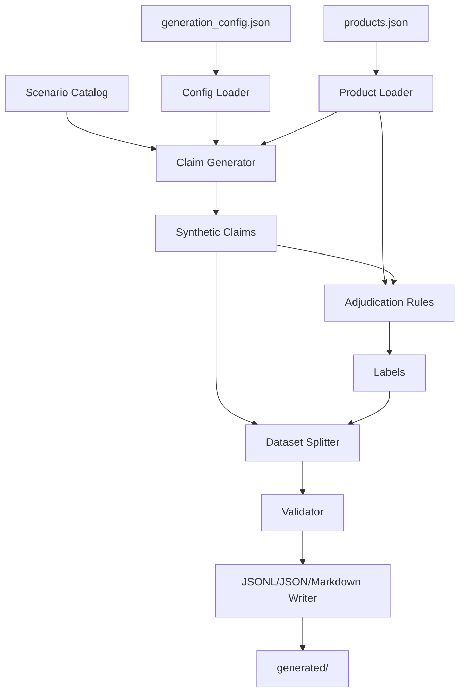
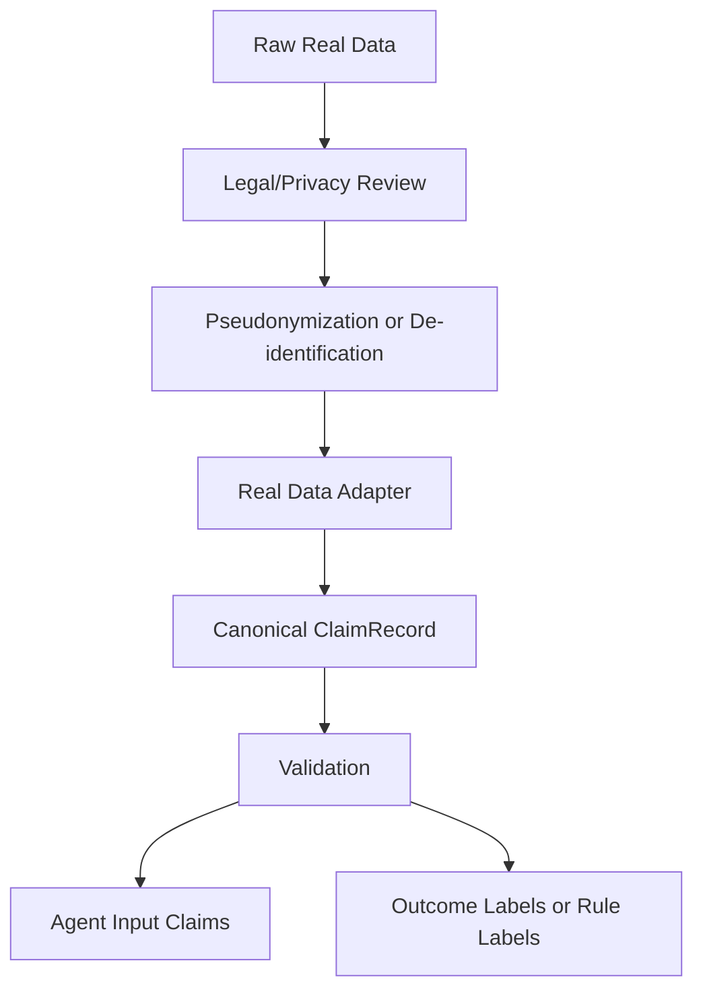
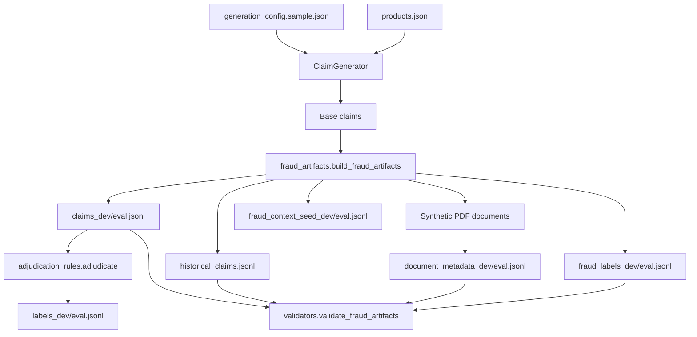

# Technical Specification: Synthetic Claims Data Generator

## 1. 목적

이 문서는 `data_generator/docs/PRD.md`와 `data_generator/samples/policy_documents.md`를 기준으로 Synthetic Claims Data Generator의 구현 방식을 정의한다.

Data Generator의 모든 소스, 설정, 샘플, 테스트, 생성 결과물은 `data_generator/` 하위에만 위치해야 한다. 상위 프로젝트 루트에는 실행 스크립트, 설정 파일, 캐시 파일, 생성 산출물을 만들지 않는다.

## 2. 설계 원칙

- 합성 데이터만 생성한다. 실제 개인정보, 실제 의료정보, 실제 보험계약 정보는 사용하지 않는다.
- Agent 입력과 정답 라벨을 분리한다. Agent는 `policy_documents.md`와 `claims_*.jsonl`만 사용한다.
- 정답 라벨은 LLM이 아니라 결정론적 룰엔진으로 생성한다.
- 동일 seed와 동일 설정에서는 동일 산출물이 생성되어야 한다.
- 상품 정의, 청구 생성, 룰 판정, 검증, 파일 저장을 분리해 향후 다른 보험 상품으로 확장 가능하게 한다.
- 구현은 기본적으로 Python 표준 라이브러리만 사용한다. 필요 시 테스트 도구만 선택적으로 추가한다.

## 3. 아키텍처



### 3.1 컴포넌트 책임

`Config Loader`

- `generation_config.sample.json` 또는 사용자 지정 config를 로딩한다.
- seed, 생성 건수, 라벨 분포, 청구 유형 분포, 금액 범위, 출력 경로를 정규화한다.

`Product Loader`

- `samples/products.json` 또는 사용자 지정 상품 정의를 로딩한다.
- 담보 코드, 한도, 자기부담금, 필수서류, 면책 조건, 사람 심사 조건을 조회 가능한 형태로 변환한다.

`Scenario Catalog`

- PRD의 필수 시나리오를 명시적으로 등록한다.
- 각 시나리오는 claim 생성 함수와 기대 라벨 유형을 가진다.
- 예: `normal_covered_outpatient`, `missing_required_document`, `duplicate_receipt_suspected`.

`Claim Generator`

- seed 기반 난수 생성기로 합성 청구건을 만든다.
- `claim_id`, `policy_id`, `receipt_id`, `synthetic_person_id`는 실제 식별자와 혼동되지 않는 접두사를 사용한다.
- 시나리오 목적에 맞게 `policy`, `claim`, `documents`, `claim_history`, `signals`를 조합한다.

`Adjudication Rules`

- 상품 정의와 청구건을 입력받아 정답 라벨을 생성한다.
- 판단 우선순위는 PRD와 약관 문서의 순서를 따른다.
- 지급액 계산은 담보별 한도와 자기부담금 규칙을 사용한다.

`Dataset Splitter`

- 생성된 claim/label pair를 dev/eval로 나눈다.
- `expected_decision`, `coverage_code`, `scenario_type` 분포가 크게 깨지지 않게 stratified split을 수행한다.

`Validator`

- 스키마, 참조 무결성, 금액, 라벨 우선순위, fraud flag 일관성을 검증한다.
- 검증 결과는 `generation_report.json`에 기록한다.

`Writer`

- JSON, JSONL, Markdown 파일을 UTF-8로 저장한다.
- 생성 결과는 기본적으로 `data_generator/generated/`에만 저장한다.

## 4. 폴더 구조

권장 구현 구조는 다음과 같다.

```text
data_generator/
  docs/
    PRD.md
    TECH_SPEC.md
  samples/
    products.json
    policy_documents.md
    generation_config.sample.json
    claims_sample.jsonl
    labels_sample.jsonl
    evaluation_cases_sample.jsonl
  src/
    __init__.py
    cli.py
    config.py
    constants.py
    schemas.py
    product_loader.py
    scenario_catalog.py
    claim_generator.py
    adjudication_rules.py
    splitter.py
    validators.py
    writer.py
    report.py
  tests/
    __init__.py
    fixtures/
      minimal_config.json
    test_adjudication_rules.py
    test_claim_generator.py
    test_reproducibility.py
    test_validators.py
  generated/
    .gitkeep
```

### 4.1 경로 규칙

- 모든 상대 경로는 `data_generator/`를 기준으로 해석한다.
- CLI는 기본 출력 위치를 `data_generator/generated/`로 제한한다.
- 사용자가 출력 경로를 지정하더라도 `data_generator/` 밖으로 나가면 에러 처리한다.
- 테스트 임시 파일도 `data_generator/generated/tmp/` 또는 시스템 임시 디렉터리를 사용하되, 최종 산출물은 `data_generator/`에만 둔다.

## 5. 주요 모듈 설계

### 5.1 `schemas.py`

Python `dataclasses`와 `typing`을 사용해 내부 데이터 구조를 정의한다.

필수 모델:

- `GenerationConfig`
- `Product`
- `Coverage`
- `DeductibleRule`
- `ClaimRecord`
- `LabelRecord`
- `CalculationResult`
- `ValidationResult`

외부 파일 입출력은 dict 기반 JSON을 유지하고, 내부 처리에서는 dataclass를 사용한다.

### 5.2 `config.py`

책임:

- config JSON 로딩
- 기본값 병합
- 비율 합계 검증
- seed 초기화
- 출력 경로 검증

필수 검증:

- `dev_count >= 0`
- `eval_count >= 0`
- 분포 값은 0 이상
- decision distribution 합계는 1.0 근처
- claim type distribution 합계는 1.0 근처

### 5.3 `product_loader.py`

책임:

- `products.json` 로딩
- `coverage_code` 기반 담보 조회
- care setting과 benefit category 기반 담보 매핑
- 필수서류 조회

담보 매핑 예:

```text
outpatient + covered -> COV_OUTPATIENT_COVERED
outpatient + noncovered -> COV_OUTPATIENT_NONCOVERED
pharmacy + covered -> COV_PRESCRIPTION
inpatient + covered -> COV_INPATIENT_COVERED
inpatient + noncovered -> COV_INPATIENT_NONCOVERED
special_noncovered + TRT-MANUAL-* -> COV_SPECIAL_MANUAL_THERAPY
special_noncovered + TRT-INJECTION-* -> COV_SPECIAL_INJECTION
special_noncovered + TRT-MRI-* -> COV_SPECIAL_MRI_MRA
```

### 5.4 `scenario_catalog.py`

각 시나리오는 다음 속성을 가진다.

- `scenario_type`
- `target_decision`
- `coverage_hint`
- `weight`
- `factory_name`

초기 필수 시나리오:

- `normal_covered_outpatient`
- `limit_exceeded_noncovered_outpatient`
- `missing_required_document`
- `lapsed_policy`
- `before_coverage_start`
- `cosmetic_exclusion`
- `normal_covered_inpatient`
- `high_amount_noncovered_inpatient`
- `normal_prescription`
- `frequent_manual_therapy`
- `duplicate_receipt_suspected`
- `mri_document_claim_mismatch`

### 5.5 `claim_generator.py`

책임:

- 시나리오를 선택한다.
- 시나리오 factory를 호출해 claim dict를 생성한다.
- 날짜, 금액, 문서, 이력, signal 값을 시나리오에 맞게 채운다.
- ID를 순차적이고 재현 가능하게 생성한다.

ID 형식:

```text
CLM-DEV-000001
CLM-EVAL-000001
POL-SYN-000001
PER-SYN-000001
RCT-SYN-000001
```

실제 주민등록번호, 전화번호, 계좌번호, 실제 병원명처럼 보이는 값은 생성하지 않는다.

### 5.6 `adjudication_rules.py`

책임:

- coverage 결정
- 필수서류 누락 판단
- 면책 판단
- 사람 심사 조건 판단
- fraud signal 판단
- 지급액 계산
- reason code와 explanation 생성

판단 우선순위:

1. fraud 또는 duplicate signal
2. 계약 실효 또는 보장기간 외
3. 필수서류 누락
4. 명확한 면책 조건
5. 사람 심사 필요 조건
6. 한도 및 자기부담금 계산
7. 정상 보장

의사코드:

```text
adjudicate(product, claim):
  coverage = resolve_coverage(product, claim)
  if has_fraud_signal(claim):
      return human_review_label(fraud_suspected=true)
  if is_policy_invalid_or_outside_period(claim):
      return deny_label(...)
  missing = find_missing_documents(coverage, claim.documents)
  if missing:
      return request_documents_label(missing)
  if has_clear_exclusion(claim):
      return deny_label(...)
  calculation = calculate_payable(coverage, claim)
  if requires_human_review(claim):
      return human_review_label(calculation)
  if calculation.limit_applied or calculation.payable_amount < claim.claimed_amount:
      return partial_pay_label(calculation)
  return pay_label(calculation)
```

### 5.7 지급액 계산

기본 계산:

```text
eligible_amount = min(claimed_amount, applicable_limit)
deductible_amount = deductible_rule(eligible_amount)
payable_amount = max(0, eligible_amount - deductible_amount)
```

`max_of_fixed_and_rate`:

```text
deductible_amount = max(fixed_amount, round(eligible_amount * rate))
```

`rate`:

```text
deductible_amount = round(eligible_amount * rate)
```

한도 결정:

- `limit_per_claim`이 있으면 1회 한도를 우선 적용한다.
- `limit_per_claim`이 없고 `annual_limit`만 있으면 샘플 단계에서는 청구금액과 연간 한도 중 작은 금액을 사용한다.
- 향후 실제 이력 기반 누적 한도는 `claim_history` 확장으로 처리한다.

### 5.8 `splitter.py`

책임:

- 생성된 claim/label pair를 dev/eval로 나눈다.
- 동일 seed에서 동일 split을 보장한다.
- 가능한 경우 `(expected_decision, coverage_code, scenario_type)` 단위로 stratified split한다.
- 표본 수가 적어 stratified split이 불가능하면 deterministic shuffle 후 ratio split한다.

### 5.9 `validators.py`

검증 항목:

- JSON serializable 여부
- claim_id 고유성
- label의 claim_id 참조 무결성
- 필수 필드 존재
- 허용 decision 값
- 지급액 0 이상
- `request_documents`이면 `missing_documents`가 비어 있지 않음
- `fraud_suspected=true`이면 `requires_human_review=true`
- Agent 입력 claim에 `expected_*`, `reason_codes`, `calculation`이 없음
- 파일이 UTF-8로 저장되었는지 확인

### 5.10 `writer.py`

책임:

- JSON은 indent 2로 저장한다.
- JSONL은 한 줄에 한 객체만 저장한다.
- 한글이 깨지지 않도록 `ensure_ascii=False`와 UTF-8을 사용한다.
- 생성 전에 출력 디렉터리를 만든다.
- 기존 생성물을 덮어쓸 때는 CLI 옵션 `--overwrite`가 필요하다.

### 5.11 `report.py`

`generation_report.json`에 다음 내용을 기록한다.

- generated_at
- seed
- config_path
- product_id
- output_dir
- counts
- decision_distribution_actual
- scenario_distribution_actual
- coverage_distribution_actual
- validation_summary
- warnings

## 6. 실행 방법

### 6.1 기본 실행

프로젝트 루트에서 실행:

```powershell
python -m data_generator.src.cli --config data_generator\samples\generation_config.sample.json --output data_generator\generated --dev-count 1000 --eval-count 200 --overwrite
```

`data_generator/` 디렉터리에서 실행:

```powershell
python -m src.cli --config samples\generation_config.sample.json --output generated --dev-count 1000 --eval-count 200 --overwrite
```

### 6.2 샘플 크기 실행

```powershell
python -m data_generator.src.cli --config data_generator\samples\generation_config.sample.json --output data_generator\generated --dev-count 10 --eval-count 2 --overwrite
```

### 6.3 검증만 실행

```powershell
python -m data_generator.src.cli validate --input data_generator\generated
```

### 6.4 테스트 실행

```powershell
python -m unittest discover -s data_generator\tests
```

## 7. CLI 사양

기본 명령:

```text
python -m data_generator.src.cli generate [options]
```

`generate`는 생략 가능하다.

옵션:

```text
--config PATH              generation config 경로
--product PATH             products.json 경로, 기본값 samples/products.json
--policy-doc PATH          policy_documents.md 경로, 기본값 samples/policy_documents.md
--output PATH              출력 디렉터리, 기본값 generated
--dev-count INT            dev claim 수
--eval-count INT           eval claim 수
--seed INT                 seed override
--overwrite                기존 generated 산출물 덮어쓰기
--report-only              파일 생성 없이 예상 분포만 출력
```

검증 명령:

```text
python -m data_generator.src.cli validate --input data_generator\generated
```

## 8. 생성 산출물

기본 산출물:

```text
data_generator/generated/products.json
data_generator/generated/policy_documents.md
data_generator/generated/claims_dev.jsonl
data_generator/generated/labels_dev.jsonl
data_generator/generated/claims_eval.jsonl
data_generator/generated/labels_eval.jsonl
data_generator/generated/evaluation_cases.jsonl
data_generator/generated/generation_report.json
```

Agent에 제공 가능한 파일:

```text
policy_documents.md
claims_dev.jsonl
claims_eval.jsonl
```

평가기 전용 파일:

```text
labels_dev.jsonl
labels_eval.jsonl
generation_report.json
```

## 9. 향후 실제 데이터 적용 시 변경 방법

실제 데이터 적용 시에는 generator 전체를 폐기하기보다, 입력 adapter와 label source를 분리해 교체한다.

### 9.1 변경 대상

`claim_generator.py`

- 합성 claim factory 대신 실제 데이터 adapter를 추가한다.
- 예: `real_data_adapter.py`가 원천 데이터를 `ClaimRecord` 스키마로 변환한다.

`adjudication_rules.py`

- 실제 보험사 약관과 심사 기준이 확정되면 룰 테이블 또는 룰엔진 구현을 교체한다.
- 실제 지급 결과가 라벨로 존재하면 hidden rule label 대신 실제 outcome label을 사용할 수 있다.

`product_loader.py`

- 실제 상품 약관 구조, 담보 코드, 한도, 자기부담금 체계에 맞는 loader를 추가한다.

`validators.py`

- 개인정보 비식별화, 가명처리, 필드 마스킹, 보관기간, 접근권한 검증을 추가한다.

### 9.2 유지 대상

- claims JSONL 스키마
- labels JSONL 스키마
- generation report 또는 ingestion report
- Agent 입력과 평가 라벨 분리 원칙
- dev/eval split 원칙
- validation pipeline

### 9.3 실제 데이터 전환 흐름



실제 데이터는 반드시 적법한 수집 근거, 이용 목적, 보관기간, 접근권한, 비식별화 또는 가명처리 절차가 확인된 뒤 사용해야 한다.

## 10. 주요 고려 사항

### 10.1 Agent 오염 방지

Agent가 정답 라벨 생성 규칙을 직접 학습하지 않도록 한다.

- Agent 입력에는 `expected_decision`, `expected_payable_amount`, `reason_codes`, `calculation`을 포함하지 않는다.
- `adjudication_rules.py`는 평가 코드에서만 import한다.
- 문서 검색용 약관은 `policy_documents.md`만 사용한다.

### 10.2 라벨 우선순위 일관성

동일 claim이 여러 조건에 해당할 수 있으므로 우선순위 테스트가 필수다.

예:

- 계약 실효와 서류 누락이 동시에 있으면 `deny`
- 서류 누락과 한도 초과가 동시에 있으면 `request_documents`
- 중복 영수증 의심이 있으면 `human_review`와 `fraud_suspected=true`

### 10.3 합성 데이터의 현실감

합성 데이터는 실제와 완전히 같을 필요는 없지만, Agent 테스트에 필요한 구조적 다양성은 가져야 한다.

필수 다양성:

- 담보 유형 다양성
- 청구금액 경계값
- 날짜 경계값
- 필수서류 누락 조합
- 면책 신호
- 반복청구 이력
- 문서와 청구 내용 불일치

### 10.4 재현성

모든 난수는 `random.Random(seed)` 인스턴스를 통해 생성한다. 전역 random state는 사용하지 않는다.

시간 값은 실행 시각에 의존하지 않는다. 필요한 경우 config에 기준일을 둔다.

### 10.5 인코딩

모든 파일은 UTF-8로 읽고 쓴다. Windows PowerShell에서 검증할 때도 `-Encoding UTF8`을 사용한다.

### 10.6 금액 반올림

원 단위 정수로 저장한다.

```text
round(amount * rate)
```

단, 회계 또는 보험사별 절사 규칙이 필요해지면 `money_rounding_policy` 설정을 추가한다.

### 10.7 샘플과 generated의 관계

`samples/`는 사람이 검토하기 위한 기준 산출물이다. Generator는 `samples/`를 수정하지 않고 `generated/`에만 결과를 쓴다.

### 10.8 확장성

다른 보험 상품을 추가할 때는 다음을 추가한다.

- 새 `products.{product_id}.json`
- 새 `policy_documents.{product_id}.md`
- 새 scenario catalog
- 새 coverage resolver
- 새 adjudication rules

공통 writer, validator, splitter는 재사용한다.

## 11. 구현 순서

1. `schemas.py`, `constants.py` 작성
2. `config.py`, `product_loader.py` 작성
3. `adjudication_rules.py`에 샘플 12건을 통과하는 단일 claim 판정 구현
4. `scenario_catalog.py`, `claim_generator.py` 작성
5. `writer.py`, `report.py` 작성
6. `validators.py` 작성
7. `splitter.py` 작성
8. `cli.py` 연결
9. 샘플 JSONL과 동일 스키마 검증
10. unittest 작성

## 12. 완료 기준

- `data_generator/generated/`에 PRD의 필수 산출물이 생성된다.
- `claims_dev.jsonl`과 `claims_eval.jsonl`에는 정답 필드가 없다.
- `labels_dev.jsonl`과 `labels_eval.jsonl`에는 모든 claim에 대한 정답이 있다.
- 동일 seed로 두 번 실행하면 byte-level 또는 JSON object-level로 동일한 결과가 나온다.
- 샘플 12건의 expected label과 룰엔진 결과가 일치한다.
- validation report가 error 없이 생성된다.
- 모든 구현 파일은 `data_generator/` 하위에만 존재한다.

## 13. Insured Profile, Age Fields, and Token-Based Fraud Features

### 13.1 Claim Payload Additions

Generated claim rows must include the following standard fields:

```json
{
  "insured_profile": {
    "insured_id": "INS-SYN-DEV-000001",
    "age_at_service": 42,
    "age_band": "40s",
    "sex": "F",
    "policyholder_relation": "self"
  },
  "claim": {
    "receipt_hash": "RH-SYN-DEV-000001",
    "provider_id": "PROV-SYN-HOSP-001"
  },
  "claim_history": {
    "same_insured_provider_claims_30d": 0,
    "same_provider_claims_30d": 0,
    "prior_receipt_hashes": []
  }
}
```

`claimant` remains as a compatibility alias, but new Agent integration should read `insured_profile`.

### 13.2 Generator Implementation

`ClaimGenerator._base()` is responsible for creating:

- synthetic `insured_id`
- `age_at_service`, `age_band`, `sex`, `policyholder_relation`
- deterministic `provider_id`
- deterministic `receipt_hash`
- claim-history aggregate counters

The generator must not create raw PII. If future real data is adapted, a separate ingestion layer must tokenize or hash direct identifiers before writing Agent input rows.

### 13.3 Hidden Label Rules

Hidden adjudication rules use the same privacy-minimized fields:

- duplicate receipt: `receipt_hash` appears in `prior_receipt_hashes`
- same insured and same provider repetition: `same_insured_provider_claims_30d >= 3`
- provider-level anomaly: `same_provider_claims_30d >= 50`
- age review: `age_at_service < 15` or `age_at_service >= 80`

Fraud and age rules must produce `human_review`; they must not produce automatic final payment or denial decisions.

## 14. Fraud_Check Data Generation Extension

### 14.1 Architecture



### 14.2 Modules

- `fraud_artifacts.py`: builds Fraud_Check-specific current claims, historical claims, synthetic insured/provider records, document metadata, claim-document links, DB seed rows, and fraud labels.
- `pdf_documents.py`: writes deterministic minimal PDFs and computes content hash, normalized text fingerprint, perceptual-hash placeholder, MIME type, file size, page count, readability status, and render mode.
- `validators.py`: validates runtime claim/label separation, recomputes claim-history aggregates from `historical_claims.jsonl`, checks PDF hash/readability, validates document-field alignment, and checks dev/eval leakage.
- `cli.py`: writes the existing claim-review outputs and the new Fraud_Check outputs in one generation command.

### 14.3 Output Structure

```text
data_generator/generated/
  insureds.json
  providers.json
  historical_claims.jsonl
  claims_dev.jsonl
  claims_eval.jsonl
  labels_dev.jsonl
  labels_eval.jsonl
  document_metadata_dev.jsonl
  document_metadata_eval.jsonl
  claim_document_links_dev.jsonl
  claim_document_links_eval.jsonl
  fraud_labels_dev.jsonl
  fraud_labels_eval.jsonl
  fraud_context_seed_dev.jsonl
  fraud_context_seed_eval.jsonl
  documents/
    dev/{claim_id}/*.pdf
    eval/{claim_id}/*.pdf
  generation_report.json
```

### 14.4 Runtime vs Evaluation Boundary

Runtime-safe files:

- `claims_dev.jsonl`
- `claims_eval.jsonl`
- `historical_claims.jsonl`
- `document_metadata_dev.jsonl`
- `document_metadata_eval.jsonl`
- `fraud_context_seed_dev.jsonl`
- `fraud_context_seed_eval.jsonl`

Evaluation-only files:

- `labels_dev.jsonl`
- `labels_eval.jsonl`
- `fraud_labels_dev.jsonl`
- `fraud_labels_eval.jsonl`

`fraud_labels_*` must not be passed into Fraud_Check runtime or the claim-review workflow. Runtime claim rows use a neutral `scenario_type` for Fraud_Check cases so exact fraud scenario names remain isolated in `fraud_labels_*`.

### 14.5 History Aggregation

`recalculate_claim_history(current_claim, historical_claims)` is the canonical aggregation function for:

- prior receipt IDs and hashes
- same insured/provider 30-day count
- provider-level 30-day count
- same diagnosis 90-day count
- manual therapy 180-day count

Rules:

- A historical claim is included only when its treatment start date is before the current claim treatment start date.
- Exactly 30 days before the current claim is included in 30-day counters.
- Future-dated historical rows are excluded.
- `claim_history` in current claims must equal the recomputed result from individual historical rows.

### 14.6 PDF Generation

Readable PDFs are deterministic minimal PDFs generated with the Python standard library. Each readable PDF includes:

- `SYNTHETIC TEST DOCUMENT / 실제 사용 불가`
- document ID
- receipt ID
- insured ID
- provider ID and provider name
- issue date
- treatment start/end dates
- diagnosis code
- treatment code
- claimed amount
- document type

Document-failure scenarios use metadata status values:

- `missing`
- `corrupted`
- `low_ocr`
- `password_protected`

Corrupted/protected documents are intentionally unreadable and are validated separately from unexpected PDF failures.

### 14.7 Configuration

`generation_config.sample.json` supports:

- `fraud_generation.enabled`
- `fraud_generation.generate_pdfs`
- `fraud_generation.scan_pdf_ratio`
- `fraud_generation.corrupt_document_ratio`
- `fraud_generation.base_date`
- `fraud_generation.history_days`
- `fraud_generation.provider_count`
- `fraud_generation.insured_count`
- `fraud_generation.scenario_ratios`

Current implementation guarantees one instance per required fraud scenario per split. The ratio values are reserved for scaling scenario oversampling while retaining the mandatory minimum.

### 14.8 Validation and Tests

Validation covers:

- claim-review schema compatibility
- runtime claim label leakage prevention
- fraud label isolation
- document file existence and hash match
- expected unreadable document handling
- structured PDF fields vs claim fields
- fraud mutation alignment with fraud labels
- prior receipt ID/hash recomputation
- 30-day, 90-day, and 180-day aggregate recomputation
- dev/eval insured, receipt, and document fingerprint separation

Test entry point:

```powershell
python -m unittest discover -s data_generator\tests
```

## 15. Medical Code and Causality Generation

### 15.1 Output Contract

The Data Generator writes the following specialist-agent evaluation outputs under `data_generator/generated/`:

```text
medical_code_registry.json
edi_code_registry.json
diagnosis_treatment_rules.json
insurer_medical_routing_rules.json
medical_labels_dev.jsonl
medical_labels_eval.jsonl
code_mapping_labels_dev.jsonl
code_mapping_labels_eval.jsonl
policy_coverage_labels_dev.jsonl
policy_coverage_labels_eval.jsonl
medical_document_metadata_dev.jsonl
medical_document_metadata_eval.jsonl
medical_context_seed_dev.jsonl
medical_context_seed_eval.jsonl
```

The runtime claim payload must not include answer labels. The generated runtime fields may include only evidence-like inputs such as raw diagnosis text, submitted diagnosis code, submitted treatment code, document references, prior-history aggregates, extraction status, and `medical_evidence`.

`medical_evidence` is added to each generated claim as a runtime-safe object:

```json
{
  "schema_version": "1.0.0",
  "code_mapping_candidates": {
    "kcd": [{"code": "M54.5", "confidence": 0.93, "source": "synthetic_code_mapper"}],
    "edi": [{"code": "EDI-MM010", "confidence": 0.92, "source": "synthetic_code_mapper"}],
    "ambiguous": false,
    "ambiguity_reason": "single high-confidence synthetic mapping"
  },
  "prior_medical_evidence": {
    "prior_diagnoses_180d": [],
    "prior_surgeries_365d": [],
    "prior_tests_180d": [],
    "treatment_continuity_days": 0,
    "pre_existing_condition_indicators": []
  },
  "insurer_medical_routing_rules": [
    {
      "rule_id": "SYN-MED-ROUTE-CONTINUE",
      "rule_version": "synthetic-insurer-medical-routing-1.0.0",
      "matched": true,
      "routing": "continue_claim_review",
      "reason_code": "DIAGNOSIS_TREATMENT_COMPATIBLE",
      "confidence": 0.82
    }
  ],
  "synthetic": true
}
```

This object intentionally excludes `expected_*`, hidden scenario names, final claim-review labels, and fraud labels.

`insurer_medical_routing_rules.json` contains the replaceable rule registry used to populate `medical_evidence.insurer_medical_routing_rules`. The bundled rows are synthetic "Synthetic Insurer A" rules with `approval_status=synthetic_insurer_approved`; production replacement must use insurer-approved rows with controlled versioning, owner, effective dates, and source governance.

### 15.2 Registry Shape

Future KCD registry rows should support:

- `code_system`: `KCD`
- `code`
- `code_name`
- `parent_code`
- `chapter`
- `category`
- `valid_from`
- `valid_to`
- `version`
- `aliases`

Future EDI registry rows should support:

- `code_system`: `EDI`
- `code`
- `code_name`
- `procedure_group`
- `benefit_category`
- `valid_from`
- `valid_to`
- `version`
- `aliases`

Diagnosis-treatment rule rows should support:

- `kcd_code`
- `edi_code`
- `relationship`: `compatible`, `weakly_related`, `not_related`, `unknown`
- `medical_necessity_level`: `supported`, `partially_supported`, `unsupported`, `insufficient_evidence`
- `required_documents`
- `age_min`
- `age_max`
- `sex_constraint`
- `review_policy`: `continue_claim_review`, `request_documents`, `human_review`
- `reason_code`
- `version`

Insurer medical routing rule rows should support:

- `rule_id`
- `rule_version`
- `rule_name`
- `description`
- `routing`: `continue_claim_review`, `request_documents`, `human_review`
- `reason_code`
- `default_confidence`
- `approval_status`: `synthetic_insurer_approved`, `insurer_approved`, `draft`, or `deprecated`
- `owner`
- `effective_from`
- `effective_to`
- `synthetic`

### 15.3 Scenario Generation

Scenario generation should be deterministic by seed and must guarantee minimum coverage for:

- KCD exact match and alias match
- KCD ambiguous match
- EDI exact match and alias match
- EDI ambiguous match
- compatible diagnosis-treatment pair
- weakly related pair
- unrelated pair
- possible pre-existing condition
- possible excessive treatment
- sufficient medical evidence
- insufficient medical evidence
- document extraction failure

### 15.4 Validation

Future validators must check:

- generated KCD/EDI codes exist in their registries
- aliases map to deterministic candidate sets
- diagnosis-treatment labels match the hidden rule table
- medical-review labels are absent from runtime claim payloads
- runtime `medical_evidence` exists, uses known KCD/EDI candidates, has bounded confidence values, and contains at least one routing rule
- medical document metadata references existing synthetic files
- VLM-required scenarios are marked as document-understanding scenarios, not as automatic claim decisions
- dev/eval leakage is prevented for patient tokens, document lineage, and medical-label rows

### 15.5 Compatibility Rule

The Data Generator must remain independent. It may generate medical evidence and labels, but it must not import or execute MVP runtime logic. Compatibility with the AI Agent Template must be verified through integration tests after the Template schema is versioned.

## 다중 상품 카탈로그 및 Policy 생성

다중 상품 원본은 `data_generator/catalog/products`에 상품별 JSON과
`product_catalog.json`으로 보존한다. 생성 시 이를
`data_generator/generated/products`로 복사하고, 기존 plugin 호환을 위해 현재
active product를 `generated/products.json`에도 기록한다.

`policies.jsonl`은 상품마다 최소 2건 이상의 합성 Policy와 현재 생성 Claim이
참조하는 Policy를 포함한다. Validator는 다음 불변식을 강제한다.

- `product_id`와 `policy_id`는 각각 유일해야 한다.
- Policy가 참조하는 Product가 카탈로그에 존재해야 한다.
- Claim이 참조하는 Policy가 존재해야 한다.
- Claim의 `product_id`와 해당 Policy의 `product_id`가 일치해야 한다.
- 의료 Claim 자동 생성은 현재 의료 care setting/benefit category와 호환되는 Product에만 적용한다.

레거시 한 열 CSV는 `import-products` 명령으로 한 번 정규화하고, 검증 완료 후
CSV를 삭제한다. 이후 생성과 런타임은 CSV를 읽지 않는다.
