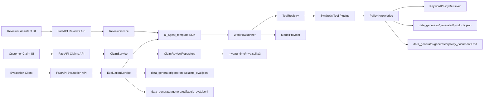
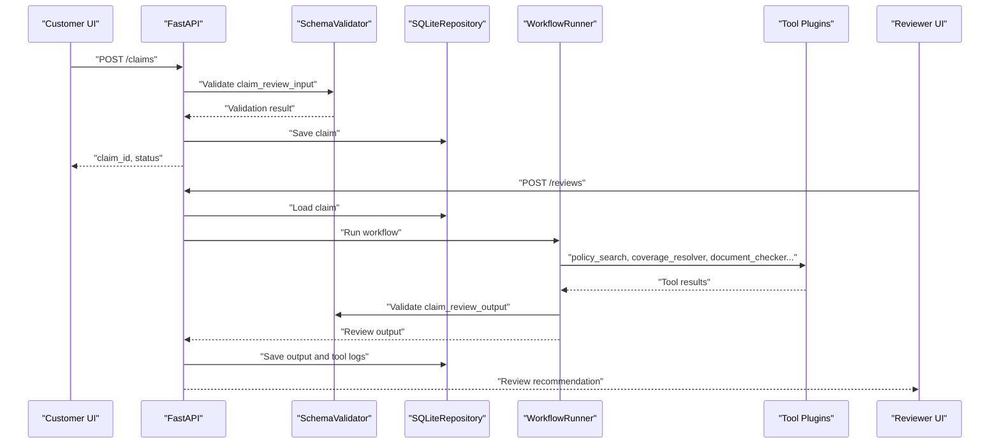

# Technical Specification: Insurance Claims Review AI Agent MVP

## 1. 문서 목적

이 문서는 `/mvp/docs/PRD.md`를 기준으로 보험 청구 자동 심사 보조 AI Agent MVP의 구현 방식을 정의한다.

MVP는 `data_generator`와 `ai_agent_template`을 기반으로 동작하는 실행 가능한 애플리케이션이다. 단, MVP는 보험금 지급을 자동 확정하지 않으며, 보험 심사자에게 보조 의견과 근거를 제공하는 것을 목표로 한다.

본 문서의 주요 목적은 다음과 같다.

- `/mvp` 하위 구현 범위와 책임 경계를 명확히 한다.
- FastAPI, SQLite, Template SDK, synthetic plugin 기반 실행 구조를 정의한다.
- 고객 청구 화면과 심사자 assistant 화면의 전문적인 UI/UX 기준을 정의한다.
- 테스트 전략, 평가 방법, MVP 이후 고도화 포인트를 정의한다.

## 2. 설계 원칙

MVP 구현은 다음 원칙을 따른다.

1. Agent는 최종 지급 결정을 내리지 않고 심사자 보조 의견만 제공한다.
2. 입력과 출력은 `ai_agent_template`의 JSON Schema를 그대로 사용한다.
3. 지급예상금액은 LLM이 아니라 `payable_calculator` plugin 결과를 사용한다.
4. `human_review` 강제 조건은 UI, API, workflow 어느 계층에서도 우회하지 않는다.
5. 정답 라벨은 evaluation service에서만 읽고 review runtime에서는 접근하지 않는다.
6. SQLite를 기본 저장소로 사용하되 repository abstraction을 통해 PostgreSQL 전환 가능성을 열어 둔다.
7. 보험사별 약관, 모델, 도구, 데이터 소스 차이는 코드 수정이 아니라 config와 plugin 교체로 흡수한다.

## 3. 전체 아키텍처

### 3.1 논리 구조



### 3.2 런타임 처리 흐름



### 3.3 MVP와 기존 모듈의 관계

MVP는 다음 모듈을 참조한다.

| 모듈 | 역할 | MVP에서의 사용 방식 |
| --- | --- | --- |
| `data_generator` | synthetic 상품, 약관, 청구, 라벨 생성 | generated 파일을 입력 데이터와 평가 데이터로 사용 |
| `ai_agent_template` | schema, workflow, SDK, plugin interface, 기본 synthetic plugin 제공 | SDK import 및 schema validation, workflow 실행에 사용 |
| `mvp` | 실제 실행 가능한 앱 | FastAPI API, UI prototype, DB, service layer, evaluation endpoint 구현 |

MVP는 `ai_agent_template`의 schema와 SDK 파일을 복사해서 수정하지 않는다. 변경이 필요하면 Template을 먼저 versioning하고, MVP는 해당 version을 명시적으로 참조한다.

## 4. 기술 스택

| 영역 | 선택 기술 | 비고 |
| --- | --- | --- |
| API | FastAPI | `/claims`, `/reviews`, `/evaluations/runs` 제공 |
| 실행 서버 | Uvicorn | local 개발 실행 |
| 언어 | Python 3.11 이상 권장 | 현재 로컬 Python 3.14 환경도 고려 |
| 저장소 | SQLite | `mvp/runtime/mvp.sqlite3` |
| Schema Validation | `jsonschema` 또는 Template SDK validator | Draft 2020-12 |
| Agent Workflow | `ai_agent_template` SDK | `WorkflowRunner`, `ToolRegistry`, `EvaluationRunner` |
| Policy Retrieval | `ai_agent_template` SDK | `KeywordPolicyRetriever`, RAG-ready retrieval schema |
| UI | FastAPI static HTML/CSS/JS 또는 Jinja2 | MVP는 단순 배포 가능한 prototype 우선 |
| 테스트 | `unittest` 우선, 필요 시 `pytest` 추가 | 기존 프로젝트 테스트 방식과 일관성 유지 |

Docker는 MVP 필수 요건이 아니다. 향후 운영 배포 단계에서 Dockerfile과 compose 파일을 추가한다.

## 5. 디렉토리 구조

MVP 구현은 `/mvp` 하위에서만 수행한다.

```text
mvp/
  app/
    __init__.py
    main.py
    api/
      __init__.py
      claims.py
      reviews.py
      evaluations.py
      configs.py
      standards.py
    core/
      __init__.py
      settings.py
      claim_service.py
      review_service.py
      evaluation_service.py
      policy_knowledge_service.py
      errors.py
    db/
      __init__.py
      repository.py
      sqlite.py
      migrations.py
      schema.sql
      migrations/
        001_initial.sql
    ui/
      customer_claim_screen.html
      reviewer_assistant_screen.html
      assets/
        app.css
        customer.js
        reviewer.js
    runtime/
      .gitkeep
    config/
      app_config.yaml
      model_config.yaml
      plugins.yaml
    tests/
      test_app_factory.py
      test_claims_api.py
      test_reviews_api.py
      test_evaluations_api.py
      test_repository.py
      test_policy_knowledge_service.py
      test_ui_routes.py
    docs/
      PRD.md
      TECH_SPEC.md
  README.md
```

### 5.1 주요 파일 책임

| 파일 | 책임 |
| --- | --- |
| `app/main.py` | FastAPI app factory, router 등록, static UI mount |
| `app/core/settings.py` | config 파일 경로, 환경변수 override, runtime path 관리 |
| `app/core/claim_service.py` | claim validation, 저장, 조회 |
| `app/core/review_service.py` | workflow 실행, output validation, 결과 저장 |
| `app/core/evaluation_service.py` | eval dataset 실행, metric 계산, 결과 저장 |
| `app/core/policy_knowledge_service.py` | 상품/약관 파일 로딩, plugin context 구성 |
| `app/db/repository.py` | repository protocol 정의 |
| `app/db/sqlite.py` | SQLite repository 구현 |
| `app/db/migrations.py` | migration runner |
| `app/ui/*` | 고객/심사자 화면 prototype |

## 6. 설정 구조

MVP 설정은 `ai_agent_template/docs/CONFIGURATION.md`의 원칙을 따른다.

### 6.1 `mvp/config/app_config.yaml`

```yaml
app:
  name: insurance-claims-review-mvp
  environment: local
  debug: true

paths:
  template_root: ../ai_agent_template
  policy_documents: ../data_generator/generated/policy_documents.md
  products_json: ../data_generator/generated/products.json
  claims_eval: ../data_generator/generated/claims_eval.jsonl
  labels_eval: ../data_generator/generated/labels_eval.jsonl
  sqlite_path: runtime/mvp.sqlite3
  reports_dir: runtime/reports

workflow:
  fail_closed: true
  low_confidence_threshold: 0.75

retrieval:
  enabled: true
  mode: keyword
  top_k: 3
```

### 6.2 `mvp/config/model_config.yaml`

```yaml
provider:
  id: mock_model_provider
  type: synthetic
  model_id: mock-review-assistant
  timeout_seconds: 30
```

향후 보험 특화 모델 적용 시 같은 파일에서 provider 설정만 교체한다.

```yaml
provider:
  id: insurer_model_provider
  type: openai_compatible
  base_url: ${CLAIM_AGENT_MODEL_BASE_URL}
  api_key: ${CLAIM_AGENT_MODEL_API_KEY}
  model_id: ${CLAIM_AGENT_MODEL_ID}
  timeout_seconds: 60
```

### 6.3 `mvp/config/plugins.yaml`

```yaml
plugins:
  policy_search:
    module: ai_agent_template.developer_kit.plugins.synthetic.policy_search_plugin
    class: SyntheticPolicySearchPlugin
  coverage_resolver:
    module: ai_agent_template.developer_kit.plugins.synthetic.coverage_resolver_plugin
    class: SyntheticCoverageResolverPlugin
  document_checker:
    module: ai_agent_template.developer_kit.plugins.synthetic.document_checker_plugin
    class: SyntheticDocumentCheckerPlugin
  exclusion_checker:
    module: ai_agent_template.developer_kit.plugins.synthetic.exclusion_checker_plugin
    class: SyntheticExclusionCheckerPlugin
  payable_calculator:
    module: ai_agent_template.developer_kit.plugins.synthetic.payable_calculator_plugin
    class: SyntheticPayableCalculatorPlugin
  risk_checker:
    module: ai_agent_template.developer_kit.plugins.synthetic.risk_checker_plugin
    class: SyntheticRiskCheckerPlugin
  fraud_signal_checker:
    module: ai_agent_template.developer_kit.plugins.synthetic.fraud_signal_checker_plugin
    class: SyntheticFraudSignalCheckerPlugin
  decision_validator:
    module: ai_agent_template.developer_kit.plugins.synthetic.decision_validator_plugin
    class: SyntheticDecisionValidatorPlugin
```

### 6.4 환경변수 override

| 환경변수 | 설명 |
| --- | --- |
| `CLAIM_MVP_CONFIG_PATH` | `app_config.yaml` 경로 override |
| `CLAIM_MVP_SQLITE_PATH` | SQLite DB 파일 경로 override |
| `CLAIM_MVP_TEMPLATE_ROOT` | Template root 경로 override |
| `CLAIM_MVP_PLUGIN_CONFIG` | plugin config 경로 override |
| `CLAIM_MVP_MODEL_CONFIG` | model config 경로 override |
| `CLAIM_MVP_RETRIEVAL_ENABLED` | policy retrieval 사용 여부 |
| `CLAIM_MVP_RETRIEVAL_MODE` | retrieval mode override |
| `CLAIM_MVP_RETRIEVAL_TOP_K` | retrieval top-k override |
| `CLAIM_AGENT_MODEL_API_KEY` | hosted model provider 사용 시 API key |

secret 값은 git에 저장하지 않는다.

## 7. API 설계

API 응답은 JSON만 사용한다. 화면 HTML은 별도 UI route 또는 static route로 제공한다.

### 7.1 Health

```text
GET /health
```

응답:

```json
{
  "status": "ok",
  "service": "insurance-claims-review-mvp",
  "version": "0.1.0"
}
```

### 7.2 Claims API

```text
POST /claims
GET  /claims/{claim_id}
```

`POST /claims` 요청 본문은 `ai_agent_template/schemas/claim_review_input.schema.json`을 만족해야 한다.

성공 응답:

```json
{
  "claim_id": "CLM-000001",
  "status": "accepted",
  "schema_version": "2020-12"
}
```

검증 실패 응답:

```json
{
  "error": {
    "code": "VALIDATION_ERROR",
    "message": "Claim payload does not match input schema.",
    "details": [
      {
        "path": "$.claim.claimed_amount",
        "reason": "must be greater than or equal to 0"
      }
    ]
  }
}
```

### 7.3 Reviews API

```text
POST /reviews
GET  /reviews/{claim_id}
POST /reviews/{claim_id}/rerun
POST /reviews/{claim_id}/actions
```

`POST /reviews` 요청:

```json
{
  "claim_id": "CLM-000001",
  "mode": "standard"
}
```

성공 응답은 Template output schema를 만족하는 review output을 감싼다.

```json
{
  "claim_id": "CLM-000001",
  "review_status": "completed",
  "output": {
    "recommended_decision": "pay",
    "requires_human_review": false,
    "recommended_payable_amount": 35000
  }
}
```

필수 원칙:

- output schema validation 실패 시 결과를 확정 저장하지 않는다.
- tool 실패 또는 mandatory human review 조건 발생 시 `human_review`로 fail closed 처리한다.
- `recommended_payable_amount`는 `payable_calculator` 결과와 일치해야 한다.
- `policy_basis`에 retrieval citation metadata가 있으면 응답과 저장소에 보존한다.

`POST /reviews/{claim_id}/actions` 요청:

```json
{
  "action": "accept_recommendation",
  "reviewer_id": "reviewer-001",
  "override_decision": null,
  "override_payable_amount": null,
  "reviewer_note": "Agent 권고 의견을 검토 후 수용"
}
```

허용 action:

```text
accept_recommendation
modify_recommendation
request_documents
defer
mark_human_review
```

심사자 action은 Agent output을 수정하지 않고 별도 이력으로 저장한다.

### 7.4 Evaluations API

```text
POST /evaluations/runs
GET  /evaluations/runs/{run_id}
```

`POST /evaluations/runs` 요청:

```json
{
  "dataset": "generated_eval",
  "claims_path": "../data_generator/generated/claims_eval.jsonl",
  "labels_path": "../data_generator/generated/labels_eval.jsonl"
}
```

응답:

```json
{
  "run_id": "EVL-20260619-0001",
  "status": "completed",
  "metrics": {
    "schema_validity": 1.0,
    "decision_accuracy": 0.95,
    "human_review_recall": 0.99
  }
}
```

### 7.5 Config API

```text
GET /configs/model
PUT /configs/model
```

MVP에서는 local 개발 편의를 위해 model config 조회와 제한적 갱신만 제공한다. API key 같은 secret 값은 응답에 노출하지 않는다.

### 7.6 Standards API

```text
GET /standards/decision-codes
GET /standards/reason-codes
GET /standards/coverage-codes
GET /standards/document-codes
```

표준 코드 목록은 `ai_agent_template`의 standards registry를 통해 제공한다.

## 8. Service Layer 설계

### 8.1 `ClaimService`

책임:

- 입력 schema validation
- claim 중복 정책 적용
- claim 저장 및 조회
- 고객 화면에서 사용할 안전한 claim summary 생성

중복 정책:

- MVP 기본값은 동일 `claim_id` 재접수 reject
- 향후에는 idempotency key 또는 revision 기반 update로 확장 가능

### 8.2 `ReviewService`

책임:

- claim 조회
- TemplateBundle 로딩
- plugin registry 구성
- model provider 구성
- WorkflowRunner 실행
- output schema validation
- tool call log 저장
- review output 저장

처리 순서:

```text
load claim
-> validate claim input
-> load template bundle
-> load plugin config
-> build policy knowledge context
-> run workflow
-> validate output schema
-> enforce mandatory safety checks
-> save output and tool logs
-> return reviewer response
```

### 8.3 `EvaluationService`

책임:

- claims eval dataset 읽기
- labels dataset 읽기
- claim_id 기준 output과 label 매칭
- EvaluationRunner 실행
- metric 저장

주의사항:

- label file은 evaluation service에서만 접근한다.
- review service, workflow runner, tool plugin에는 label path를 전달하지 않는다.

### 8.4 `PolicyKnowledgeService`

책임:

- `products.json` 로딩
- `policy_documents.md` 로딩
- product, coverage, clause context 구성
- `KeywordPolicyRetriever` 초기화
- retrieval request/result schema validation
- `policy_basis` citation metadata 정규화
- plugin 실행 context에 policy knowledge 전달

MVP에서는 `ai_agent_template`의 `KeywordPolicyRetriever`를 기본 사용한다. 실제 vector DB, embedding, reranker는 구현하지 않는다.

향후 실제 약관 적용 시 이 계층을 `PolicyKnowledgePlugin` 또는 외부 knowledge service adapter로 확장한다.

보존해야 하는 citation metadata:

```text
chunk_id
product_id
product_version
effective_date
coverage_code
clause_id
citation_id
retrieval_score
retrieval_method
```

## 9. Repository 및 DB 설계

### 9.1 Repository Protocol

`app/db/repository.py`에서 저장소 경계를 protocol로 정의한다.

```python
class ClaimReviewRepository(Protocol):
    def save_claim(self, claim_id: str, payload: dict) -> None: ...
    def get_claim(self, claim_id: str) -> dict | None: ...
    def save_review(self, claim_id: str, output: dict, tool_logs: list[dict]) -> None: ...
    def get_review(self, claim_id: str) -> dict | None: ...
    def save_reviewer_action(self, claim_id: str, action: dict) -> None: ...
    def save_evaluation_run(self, run_id: str, result: dict) -> None: ...
    def get_evaluation_run(self, run_id: str) -> dict | None: ...
```

Service layer는 `SQLiteRepository`를 직접 생성하지 않고 app factory 또는 dependency provider에서 주입받는다.

### 9.2 SQLite 파일

기본 DB 파일:

```text
mvp/runtime/mvp.sqlite3
```

### 9.3 테이블

| 테이블 | 목적 |
| --- | --- |
| `claims` | 입력 claim payload 저장 |
| `reviews` | Agent output 저장 |
| `tool_call_logs` | tool 실행 이력 저장 |
| `reviewer_actions` | 심사자 action 저장 |
| `evaluation_runs` | 평가 실행 결과 저장 |
| `config_versions` | config snapshot 및 version 저장 |
| `schema_migrations` | 적용된 migration 기록 |

### 9.4 Migration

Migration runner는 다음 순서로 동작한다.

1. SQLite 연결
2. `schema_migrations` 테이블 생성
3. `migrations/*.sql` 파일명 순서대로 확인
4. 미적용 migration 실행
5. 적용 기록 저장

`schema.sql`은 최신 전체 schema snapshot으로 유지하고, 실제 실행 기준은 `migrations/*.sql`이다.

## 10. Workflow 및 Plugin 연동

### 10.1 기본 plugin 목록

MVP는 Template의 synthetic plugin 8개를 기본 사용한다.

| Plugin | 책임 |
| --- | --- |
| `policy_search` | 약관 조항 및 근거 검색 |
| `coverage_resolver` | 청구와 담보 매칭 |
| `document_checker` | 필수서류 누락 확인 |
| `exclusion_checker` | 면책/부지급 조건 확인 |
| `payable_calculator` | 지급예상금액 계산 |
| `fraud_signal_checker` | 중복 영수증, 문서 불일치 등 이상 신호 탐지 |
| `risk_checker` | 고액, 반복청구 등 사람 심사 조건 확인 |
| `decision_validator` | 최종 output consistency 검증 |

### 10.2 Fail Closed 정책

다음 상황은 반드시 `human_review`로 fallback한다.

- 필수 plugin 실행 실패
- output schema validation 실패
- 지급예상금액 계산 결과 없음
- 담보 매칭 confidence 기준 미달
- fraud signal 존재
- 청구 내용과 서류 불일치
- 고액 청구 또는 반복 청구 rule trigger

### 10.3 Model Provider 사용 범위

MVP의 기본 model provider는 mock 또는 synthetic provider다.

LLM은 다음 작업에만 제한적으로 사용한다.

- reviewer-facing summary 생성
- policy basis 설명 문장 정리
- 누락서류 또는 human review 사유를 자연어로 요약

LLM은 다음 작업을 수행하지 않는다.

- 지급액 산정
- 담보 적용 여부 단독 판단
- 면책 확정
- 최종 지급 결정

### 10.4 RAG-ready Policy Retrieval

MVP는 `ai_agent_template/docs/RAG_READY.md`의 계약을 따른다.

기본 흐름:

```text
PolicyKnowledgeService
-> KeywordPolicyRetriever.from_template(template)
-> WorkflowRunner(policy_retriever=...)
-> policy_search
-> policy_basis citation metadata
-> Reviewer Assistant UI
```

MVP에서 포함하는 것:

- keyword 기반 local retrieval
- retrieval schema validation
- `PolicyKnowledgePluginConformance` 기준 준수
- `policy_basis` citation metadata 저장 및 화면 표시
- retrieval disabled 시 기존 synthetic `policy_search` fallback

MVP에서 제외하는 것:

- vector DB
- embedding 생성
- reranker
- 실제 약관 PDF 자동 parsing
- 실제 고객 청구 문서 indexing

검색 결과가 없거나 citation이 불명확한 경우에는 최종 판단을 강화하지 않고 `human_review` fallback 사유로 표시한다.

## 11. UI/UX 기술 사양

MVP 화면은 prototype이지만 실제 보험 심사 업무자가 사용할 수 있는 전문적인 수준을 목표로 한다. 마케팅 랜딩 페이지가 아니라, 업무 도구의 첫 화면부터 바로 청구 접수와 심사 작업이 가능해야 한다.

### 11.1 공통 UI 원칙

- 화면은 보험 업무용 operational tool처럼 조용하고 정돈된 톤을 사용한다.
- 장식적 hero, 과한 gradient, 홍보 문구 중심 layout은 사용하지 않는다.
- 정보 밀도는 충분히 높게 유지하되, 상태와 우선순위가 즉시 보이도록 구성한다.
- 주요 action은 상단 또는 우측 고정 영역에 배치한다.
- 고객 화면에는 내부 위험 신호, fraud score, 정답 라벨, 내부 reason code를 노출하지 않는다.
- 심사자 화면에는 policy basis, reason code, calculation detail, confidence를 명확히 노출한다.
- 버튼, 상태 badge, table, form control은 크기와 간격을 안정적으로 유지한다.
- 모바일에서는 1 column, 데스크톱에서는 2 column 또는 split pane을 사용한다.
- 텍스트가 버튼이나 card 내부에서 잘리지 않도록 최소 폭과 줄바꿈 정책을 둔다.

### 11.2 Visual Style

권장 스타일:

| 요소 | 기준 |
| --- | --- |
| 색상 | 흰색/회색 기반 배경, 짙은 남청색 텍스트, 상태 색상은 절제해서 사용 |
| 상태 색상 | pay/partial_pay: green, request_documents: amber, deny: red, human_review: blue 또는 violet |
| Radius | card와 panel은 6px 또는 8px 이하 |
| Typography | 업무용 sans-serif, hero-scale type 미사용 |
| Density | table, summary row, side panel을 활용해 반복 업무에 적합한 밀도 유지 |
| Icon | action button에는 가능하면 icon과 label을 함께 사용 |
| Motion | 필수 feedback 외 animation 최소화 |

### 11.3 고객 청구 화면

파일:

```text
mvp/app/ui/customer_claim_screen.html
```

화면 구성:

```text
Top bar
  - 서비스명
  - 입력 상태

Main content
  Left: Claim form
    - 계약 정보
    - 상품 정보
    - 진료 정보
    - 청구 금액
    - 제출서류
    - 청구 이력

  Right: Submission summary
    - 입력 완성도
    - 제출 전 확인 항목
    - JSON payload preview
    - Submit button
```

고객 화면 validation:

- 필수값 누락은 field-level message로 표시한다.
- 금액, 날짜, 코드값은 제출 전 client-side validation을 수행한다.
- 최종 검증은 server-side schema validation이 기준이다.

고객 화면에서 숨길 정보:

- fraud signal
- human review internal rule
- reason code
- label
- model confidence

### 11.4 심사자 Assistant 화면

파일:

```text
mvp/app/ui/reviewer_assistant_screen.html
```

화면 구성:

```text
Top bar
  - claim_id search
  - review status
  - rerun button

Left pane
  - claim summary
  - policy and product summary
  - submitted documents
  - claim history

Center pane
  - recommended decision
  - recommended payable amount
  - coverage match
  - calculation detail
  - missing documents
  - exclusion and fraud signals

Right pane
  - policy basis
  - citation id / clause id / retrieval score
  - reason codes
  - confidence
  - reviewer notes
  - reviewer action buttons
```

심사자 action:

| Action | 의미 |
| --- | --- |
| `accept_recommendation` | Agent 보조 의견 수용 |
| `modify_recommendation` | 금액 또는 결정 의견 수정 |
| `request_documents` | 추가서류 요청 |
| `defer` | 보류 |
| `mark_human_review` | 사람 심사 지정 |

심사자 action은 `POST /reviews/{claim_id}/actions`로 저장하며, Agent output과 분리된 reviewer audit trail로 관리한다.

심사자 화면에서는 모든 결정을 "권고", "보조 의견", "검토 필요"로 표현한다. "지급 확정", "부지급 확정" 같은 표현은 사용하지 않는다.

### 11.5 Empty, Loading, Error State

| 상태 | UI 처리 |
| --- | --- |
| Empty | claim_id 입력 또는 sample claim 선택 안내 |
| Loading | skeleton row 또는 compact spinner 표시 |
| Validation Error | field-level error와 JSON path 표시 |
| Tool Failure | 심사자 화면에 `human_review` fallback 사유 표시 |
| No Review | review 실행 button 표시 |

### 11.6 Accessibility

- 모든 form control에 label을 연결한다.
- 색상만으로 상태를 구분하지 않고 text label을 함께 제공한다.
- keyboard focus outline을 제거하지 않는다.
- table header와 data cell 관계를 유지한다.
- 버튼의 click target은 최소 36px 높이를 유지한다.

## 12. 표준화

MVP는 Template의 standards registry를 기준으로 표준 코드를 사용한다.

표준화 대상:

- decision code
- reason code
- coverage code
- document code
- care setting
- benefit category
- human review reason

MVP 내부에서 임의 문자열을 새로 만들지 않는다. 새로운 코드가 필요하면 Template standards registry에 먼저 추가하고 schema와 평가 기준을 함께 갱신한다.

## 13. 테스트 전략 및 방법

### 13.1 테스트 계층

| 계층 | 목적 | 대상 |
| --- | --- | --- |
| Unit Test | 함수와 service 단위 검증 | validator, settings, repository, policy service |
| Contract Test | schema와 plugin contract 검증 | input/output schema, plugin interface, retrieval schema |
| Integration Test | 모듈 간 호환성 검증 | data_generator output -> template input -> MVP review |
| API Test | FastAPI endpoint 검증 | `/claims`, `/reviews`, `/evaluations/runs` |
| UI Smoke Test | 화면 route와 기본 interaction 검증 | customer/reviewer 화면 |
| Evaluation Test | synthetic dataset 기준 성능 확인 | eval metrics |
| Safety Test | 필수 안전 조건 검증 | human_review, label leakage, secret masking |

### 13.2 Unit Test

필수 테스트:

- settings가 기본 config를 로딩한다.
- 환경변수 override가 적용된다.
- SQLite migration이 idempotent하게 동작한다.
- repository가 claim, review, tool log, evaluation run을 저장/조회한다.
- PolicyKnowledgeService가 `products.json`과 `policy_documents.md`를 로딩한다.
- PolicyKnowledgeService가 `KeywordPolicyRetriever`를 초기화하고 retrieval result를 검증한다.
- ClaimService가 invalid payload를 저장하지 않는다.
- ReviewService가 output schema validation을 수행한다.

실행:

```powershell
python -m unittest discover -s mvp\tests
```

### 13.3 Contract Test

필수 테스트:

- `POST /claims` payload가 `claim_review_input.schema.json`을 통과한다.
- `ReviewService` output이 `claim_review_output.schema.json`을 통과한다.
- 8개 기본 plugin이 ToolPlugin conformance를 통과한다.
- policy retriever가 `PolicyKnowledgePluginConformance`를 통과한다.
- retrieval request/result가 Template retrieval schema를 통과한다.
- `recommended_payable_amount`와 `calculation.payable_amount`가 일치한다.
- `request_documents`일 때 `missing_documents`가 비어 있지 않다.

### 13.4 Integration Test

필수 테스트:

- `data_generator/generated/claims_dev.jsonl` sample을 MVP `/claims`에 접수할 수 있다.
- 접수된 claim을 `/reviews`로 심사할 수 있다.
- review output이 SQLite에 저장된다.
- tool call log가 저장된다.
- `policy_basis`의 `citation_id`, `clause_id`, `retrieval_score`가 보존된다.
- `labels_dev.jsonl`은 review runtime에서 접근되지 않는다.

권장 위치:

```text
mvp/tests/test_integration_generated_claims.py
```

단, `data_generator`와 `ai_agent_template`의 독립 호환성 검증은 기존 `integration_tests`를 유지한다.

### 13.5 API Test

FastAPI TestClient를 사용한다.

테스트 항목:

- `GET /health` returns 200
- `POST /claims` valid payload returns accepted
- `POST /claims` invalid payload returns `VALIDATION_ERROR`
- `GET /claims/{claim_id}` returns stored claim
- `POST /reviews` returns schema-valid review
- `GET /reviews/{claim_id}` returns stored review
- `POST /reviews/{claim_id}/actions` stores reviewer action
- `POST /evaluations/runs` returns metrics

FastAPI가 사용자 AppData site-packages에만 설치된 경우 sandbox 테스트에서는 import가 skip될 수 있다. 로컬 사용자 터미널에서는 같은 Python 실행 파일로 재검증한다.

### 13.6 UI Smoke Test

최소 검증:

- 고객 화면 HTML route가 200을 반환한다.
- 심사자 화면 HTML route가 200을 반환한다.
- 고객 화면의 submit button, 필수 input, JSON preview 영역이 존재한다.
- 심사자 화면의 claim search, decision panel, policy basis 영역이 존재한다.
- 주요 텍스트가 작은 화면에서도 겹치지 않는다.

향후 Playwright 도입 시:

```powershell
python -m pytest mvp\tests\ui
```

또는 Node 기반 Playwright를 별도 dev dependency로 분리한다.

### 13.7 Evaluation Test

평가 데이터:

```text
data_generator/generated/claims_eval.jsonl
data_generator/generated/labels_eval.jsonl
```

합격 기준:

```text
schema_validity = 100%
decision_accuracy >= 90%
coverage_accuracy >= 95%
payable_amount_exact_match >= 95%
missing_document_exact_match >= 95%
human_review_recall >= 98%
fraud_suspected_recall >= 98%
false_denial_rate <= 1%
human_review_miss_rate <= 1%
```

MVP 개발 중에는 `claims_dev.jsonl`로 빠른 회귀 테스트를 수행하고, 완료 기준 검증 시 `claims_eval.jsonl`을 사용한다.

### 13.8 Safety Test

필수 테스트:

- fraud signal이 있으면 항상 `human_review`다.
- confidence threshold 미만이면 항상 `human_review`다.
- 필수 tool 실패 시 항상 `human_review`다.
- label file path가 ReviewService와 WorkflowRunner context에 포함되지 않는다.
- API response와 log에 API key가 노출되지 않는다.
- 고객 화면에 내부 reason code와 fraud signal이 노출되지 않는다.
- retrieval index에 `labels_*.jsonl`이 포함되지 않는다.
- retrieval 결과가 없거나 citation이 불명확하면 `human_review` fallback이 가능하다.

## 14. 실행 방법

### 14.1 의존성 설치

권장:

```powershell
python -m pip install fastapi uvicorn jsonschema pyyaml
```

테스트 도구가 필요하면 추가 설치한다.

```powershell
python -m pip install pytest httpx
```

### 14.2 DB 초기화

MVP app 시작 시 migration runner가 자동 실행되도록 구현한다. 수동 실행 command가 필요하면 다음 형태를 제공한다.

```powershell
python -m mvp.app.db.migrations --config mvp\config\app_config.yaml
```

### 14.3 API 서버 실행

workspace root에서 실행:

```powershell
python -m uvicorn mvp.app.main:app --reload --port 8010
```

예상 URL:

```text
http://127.0.0.1:8010
```

### 14.4 화면 접근

```text
http://127.0.0.1:8010/ui/customer
http://127.0.0.1:8010/ui/reviewer
```

## 15. 실제 데이터 적용 시 변경 방법

MVP 이후 실제 보험사 데이터로 전환할 때는 다음 순서를 따른다.

### 15.1 데이터 Adapter 교체

synthetic claim payload 대신 보험사 원천 데이터를 Template input schema로 변환하는 adapter를 구현한다.

```text
insurer raw claim
-> DataAdapterPlugin
-> claim_review_input.schema.json
-> MVP ReviewService
```

### 15.2 Policy Knowledge 교체

`products.json`과 `policy_documents.md`를 직접 대체하지 않고, 실제 약관 구조화 pipeline을 거친다.

```text
보험사 약관 원문
-> clause chunking
-> policy_chunk.schema.json 변환
-> rule extraction
-> human validation
-> versioned Policy Knowledge
-> PolicyKnowledgeService 또는 Plugin
```

### 15.3 Plugin 교체

보험사별 계산, 면책, 담보 기준이 필요한 경우 `plugins.yaml`에서 구현체를 교체한다.

```yaml
plugins:
  payable_calculator:
    module: insurer_plugins.payable_calculator
    class: InsurerPayableCalculator
```

### 15.4 Repository 교체

SQLite에서 PostgreSQL로 전환할 때는 service layer를 수정하지 않고 repository 구현체와 config만 교체한다.

```text
ClaimReviewRepository
  -> SQLiteRepository
  -> PostgreSQLRepository
```

### 15.5 모델 교체

보험 특화 LLM 또는 사내 hosted model 적용 시 `model_config.yaml`의 provider 설정을 교체한다.

모델 교체 후 반드시 수행할 검증:

- output schema validity
- reason code consistency
- 지급액 계산 불개입 여부
- human review recall
- false denial rate
- reviewer explanation quality sampling

## 16. MVP 이후 고도화 포인트

### 16.1 데이터 및 약관 고도화

- 실제 보험사 claim data adapter 개발
- 약관 PDF, Word, HWP ingestion pipeline
- clause_id 기반 약관 versioning
- vector DB와 hybrid retrieval adapter
- 사람 검수 workflow
- 구조화 Policy Knowledge 관리 화면

### 16.2 Agent 고도화

- 보험 특화 model provider 적용
- RAG reranker 및 citation verifier 도입
- tool failure recovery policy 정교화
- reviewer feedback 기반 prompt 및 rule 개선
- claim complexity에 따른 workflow branching

### 16.3 심사 업무 고도화

- 심사자 queue와 worklist
- 우선순위 scoring
- SLA 기반 alert
- reviewer action history
- 이의제기 또는 재심사 workflow

### 16.4 저장소 및 운영 고도화

- PostgreSQL repository 구현
- Alembic 등 migration framework 도입 검토
- Dockerfile 및 compose 구성
- 인증/인가
- 감사 로그와 field-level masking
- 운영 monitoring과 metric dashboard

### 16.5 평가 및 품질 고도화

- 실제 데이터 holdout set 구성
- edge case dataset 구성
- false payment, false denial 중심 risk evaluation
- 심사자 품질 평가와 Agent 의견 유용성 평가
- drift monitoring
- regression benchmark 자동화

## 17. 주요 리스크와 대응

| 리스크 | 대응 |
| --- | --- |
| Agent 의견이 최종 결정처럼 보임 | UI와 API 문구를 `recommended`, `권고`, `보조 의견`으로 제한 |
| LLM이 지급액을 임의 계산 | `payable_calculator` 결과와 불일치하면 validation 실패 |
| 약관 근거 부족 | 모든 output에 `policy_basis` 필수화 |
| retrieval 결과 과신 | RAG 결과는 지급액 계산이나 최종 결정의 source of truth로 사용하지 않고, citation 가능한 근거 보조로만 사용 |
| label leakage | ReviewService와 workflow context에서 label path 제거 |
| synthetic 과적합 | dev/eval 분리, 실제 데이터 적용 전 holdout set 구성 |
| DB 전환 비용 증가 | repository protocol과 migration runner를 MVP부터 적용 |
| UI가 toy prototype처럼 보임 | 업무용 정보 구조, 밀도, 상태 표현, 접근성 기준 적용 |

## 18. 완료 기준

MVP 구현 완료 기준은 다음과 같다.

- `/mvp` 하위에서 FastAPI app이 실행된다.
- 고객 청구 화면과 심사자 assistant 화면이 제공된다.
- `POST /claims`가 Template input schema를 검증하고 저장한다.
- `POST /reviews`가 Agent workflow를 실행하고 Template output schema를 검증한다.
- 8개 synthetic plugin이 workflow에서 호출된다.
- RAG-ready keyword retrieval 경로가 연결되고 `policy_basis` citation metadata가 보존된다.
- 지급예상금액은 `payable_calculator` 결과와 일치한다.
- mandatory human review 조건이 적용된다.
- SQLite에 claim, review, tool log, evaluation run이 저장된다.
- `POST /reviews/{claim_id}/actions`로 심사자 action을 저장할 수 있다.
- `POST /evaluations/runs`로 synthetic eval을 실행할 수 있다.
- 정답 라벨은 evaluation service에서만 접근된다.
- unit, contract, integration, API, safety test가 통과한다.
- UI smoke test에서 고객 화면과 심사자 화면의 핵심 영역이 확인된다.

## 19. 개발 3단계

MVP 개발은 다음 3단계로 진행한다.

### 19.1 1단계: Foundation 및 Template 연동

목표:

- `/mvp` FastAPI app skeleton을 구성한다.
- Template SDK, schema validator, plugin loader, model provider, `KeywordPolicyRetriever`를 연결한다.
- SQLite repository, migration runner, config loader를 만든다.

주요 산출물:

- `mvp/app/main.py`
- `mvp/app/core/settings.py`
- `mvp/app/core/policy_knowledge_service.py`
- `mvp/app/db/repository.py`
- `mvp/app/db/sqlite.py`
- `mvp/app/db/migrations.py`
- `mvp/config/app_config.yaml`
- `mvp/config/model_config.yaml`
- `mvp/config/plugins.yaml`

완료 기준:

- `GET /health`가 동작한다.
- migration이 idempotent하게 실행된다.
- Template input/output schema를 MVP에서 검증할 수 있다.
- 8개 synthetic plugin이 실제 Template contract 이름으로 로딩된다.
- `KeywordPolicyRetriever`가 초기화되고 retrieval schema validation을 통과한다.

### 19.2 2단계: Claim/Review API 및 화면 구현

목표:

- 고객 청구 접수 API와 화면을 구현한다.
- 심사자 assistant API와 화면을 구현한다.
- Agent workflow를 실행하고 결과, tool log, reviewer action을 저장한다.

주요 산출물:

- `mvp/app/api/claims.py`
- `mvp/app/api/reviews.py`
- `mvp/app/core/claim_service.py`
- `mvp/app/core/review_service.py`
- `mvp/app/ui/customer_claim_screen.html`
- `mvp/app/ui/reviewer_assistant_screen.html`
- `mvp/app/ui/assets/*`

완료 기준:

- `POST /claims`가 claim을 검증하고 저장한다.
- `POST /reviews`가 workflow를 실행해 schema-valid output을 반환한다.
- `POST /reviews/{claim_id}/actions`가 reviewer action을 저장한다.
- `policy_basis`의 citation metadata가 저장되고 심사자 화면에 표시된다.
- 고객 화면에는 fraud signal, label, 내부 reason code가 노출되지 않는다.

### 19.3 3단계: Evaluation, Safety, Hardening

목표:

- synthetic eval dataset 기반 평가 API를 구현한다.
- label leakage, human review fallback, retrieval fallback 등 안전 테스트를 강화한다.
- MVP 완료 기준을 자동 테스트로 검증한다.

주요 산출물:

- `mvp/app/api/evaluations.py`
- `mvp/app/api/standards.py`
- `mvp/app/api/configs.py`
- `mvp/app/core/evaluation_service.py`
- `mvp/tests/*`

완료 기준:

- `POST /evaluations/runs`가 `claims_eval.jsonl`과 `labels_eval.jsonl`로 평가를 실행한다.
- label file은 evaluation service에서만 접근된다.
- `human_review` 강제 조건이 테스트로 검증된다.
- retrieval 결과 없음 또는 citation 불명확 상황의 fallback이 테스트된다.
- unit, contract, integration, API, UI smoke, safety test가 통과한다.
## 20. Demo Scenario Builder Separation

This section supersedes the previous demo preset placement if there is a conflict.

### 20.1 Scope

Demo scenario functionality is implemented as a separable layer.

- Customer claim intake remains `/ui/customer`.
- Internal demo testing is provided by `/ui/demo`.
- Scenario data is stored in `/mvp/config/demo_scenarios.json`.
- Scenario APIs are exposed under `/demo/*`.
- Claim/review workflow, schema, repository, and evaluation logic are not changed for demo support.

### 20.2 Runtime Components

```text
mvp/
  config/
    demo_scenarios.json
  app/
    api/
      demo.py
    core/
      demo_scenario_service.py
    ui/
      customer_claim_screen.html
      demo_scenario_builder.html
```

`DemoScenarioService` loads demo scenario config and validates each scenario claim with the Template SDK schema validator.

### 20.3 Demo API

```text
GET /demo/scenarios
GET /demo/scenarios/{scenario_id}
GET /ui/demo
```

`/demo/scenarios` returns demo metadata and synthetic claim payloads. The UI must send only the selected or edited `claim` object to `/claims` or `/reviews`; expected recommendation and verification metadata must not be included in claim payloads.

### 20.4 Demo UI

`/ui/demo` provides:

- preset scenario loading
- form-based claim editing
- direct JSON editing
- mutation buttons for edge cases
- claim submit through `/claims`
- review execution through `/reviews`
- original expected vs actual output comparison

`/ui/customer` remains a direct claim intake screen and must not show demo preset buttons, expected decision, fraud scenario labels, or verification checklist.

### 20.5 Tests

Tests must verify:

- customer UI has no demo preset controls
- demo UI loads scenario controls and mutation controls
- demo scenario config contains schema-valid claims
- each default demo scenario still produces its expected workflow decision
- `/demo/scenarios`, `/demo/scenarios/{scenario_id}`, and `/ui/demo` are registered in FastAPI

## 21. MVP Demo Scenario Presets

### 20.1 Scope

Demo scenario preset은 `/mvp/app/ui/customer_claim_screen.html`에만 구현한다.
Backend API, workflow, schema, repository, evaluation service는 변경하지 않는다.

목표는 다음 6개 대표 경로를 화면에서 빠르게 선택하고 검증하는 것이다.

| Preset Key | Expected Decision | Payload Trigger |
| --- | --- | --- |
| `normal_pay` | `pay` | active policy, covered outpatient, complete documents, amount below limit |
| `partial_pay` | `partial_pay` | active policy, covered outpatient, complete documents, amount above per-claim limit |
| `request_documents` | `request_documents` | active policy, covered outpatient, missing required document |
| `deny` | `deny` | lapsed policy |
| `human_review` | `human_review` | repeated same diagnosis claim history |
| `fraud_signal` | `human_review` | duplicate receipt signal |

### 20.2 UI Implementation

Customer UI에 `Demo Presets` button group을 추가한다.
각 button은 client-side JavaScript의 preset definition을 form field에 주입한다.

구현 원칙:

- preset definition은 browser memory에만 존재한다.
- preset expected decision과 basis는 demo guide로만 표시한다.
- `payload()`가 반환하는 JSON에는 expected result, reason label, internal evaluation label을 포함하지 않는다.
- `<option value="...">`는 schema enum code를 유지한다.
- 화면 표시 문구가 번역되거나 바뀌어도 submit payload는 code value를 사용한다.
- fraud signal preset은 demo 검증용이며 실제 고객 화면 운영 모드에서는 숨길 수 있어야 한다.

### 20.3 Expected Result Panel

Submission summary 영역에 다음 demo-only 정보를 표시한다.

- selected preset name
- expected agent recommendation
- expected basis summary
- reviewer verification checklist

이 패널은 실제 agent output이 아니다.
실제 판단 결과와 policy basis는 `/reviews` 실행 후 reviewer assistant 화면에서 확인한다.

### 20.4 Test Requirements

추가 테스트는 다음을 확인한다.

- customer UI에 6개 preset button이 존재한다.
- preset script가 expected result를 payload에 포함하지 않는다.
- 6개 preset과 동일한 synthetic claim을 `ReviewService`로 실행했을 때 expected decision과 일치한다.
- 기존 claim/review/evaluation/API/UI smoke 테스트가 계속 통과한다.

## 22. Insured Profile, UI Payload, and Fraud Signal Integration

### 22.1 UI Payload Requirements

`/ui/customer` and `/ui/demo` must construct schema-valid payloads containing `insured_profile`, `provider_id`, `receipt_hash`, and aggregate claim-history fields.

`/ui/reviewer` displays a compact insured summary:

```text
insured_id / age_at_service / sex
```

This is intentionally tokenized and excludes direct PII.

### 22.2 Demo Scenario Requirements

`/mvp/config/demo_scenarios.json` must contain schema-valid claims with:

- `insured_profile`
- tokenized `claim.provider_id`
- `claim.receipt_hash`
- `claim_history.prior_receipt_hashes`
- aggregate behavior counters

Fraud demo scenarios should trigger human review by hash or aggregate behavior, not by raw name or resident identifier.

### 22.3 Runtime Alignment

MVP uses the AI Agent Template SDK and schema validator. Therefore any claim submitted to `/claims` must pass `claim_review_input.schema.json` before persistence.

Review execution uses the Template workflow:

```text
/claims -> ClaimService.validate_claim_input -> SQLiteRepository.save_claim
/reviews -> WorkflowRunner -> fraud_signal_checker/risk_checker -> output validation
```

Age-based review and fraud signals are assistant recommendations only. They must not become final payment decisions without reviewer action.

## 23. General LLM Provider Integration

MVP runtime loads `mvp/config/model_config.yaml` through `TemplateRuntime`.

Current default:

```yaml
active_provider: general_llm
providers:
  general_llm:
    provider_type: openai_compatible
    base_url: https://m2.geniemars.kt.co.kr:10601/v1
    api_key: dummy
    model_id: gemma-4-26B-4aB-it
```

Execution model:

```text
schema validation
-> policy_search / coverage_resolver / fraud_signal_checker / document_checker
-> exclusion_checker / payable_calculator / risk_checker
-> LLM narrative generation
-> decision_validator
-> output schema validation
```

The LLM provider may update only `review_summary`, `reviewer_notes`, and the explanatory fields inside `confidence_assessment`. It must not replace deterministic `confidence`, decision, payable amount, coverage code, calculation, fraud flag, human-review flag, reason codes, or policy basis. If the hosted model is unavailable, the workflow keeps deterministic fallback text and confidence assessment so claim review does not fail solely because narrative generation failed.

Reviewer UI also displays `explanation_confidence`, which is generated by validating LLM-facing explanations against deterministic tool/rule outputs. This score is separate from `confidence` and is used only to judge the reliability of the generated explanation, not the payment recommendation itself.

## 24. Completed High-Impact Enhancements Without Real Data

This section marks post-MVP hardening items that were previously listed as future enhancements but are now implemented in the MVP codebase.

### 24.1 Completed Items

- [x] Reviewer queue and worklist API
  - Implemented `GET /reviews/queue`.
  - Queue items include claim status, latest recommendation, human-review flag, fraud flag, confidence, SLA status, SLA due time, age hours, and priority score.
- [x] Priority scoring and SLA alert foundation
  - `SQLiteRepository.list_review_queue()` computes `priority_score` and `sla_status` (`ok`, `due_soon`, `overdue`, `closed`).
  - SLA threshold is configurable per request through `sla_hours`.
- [x] Reviewer action history API
  - Implemented `GET /reviews/{claim_id}/actions`.
  - Existing `POST /reviews/{claim_id}/actions` remains unchanged.
- [x] Audit log persistence and API exposure
  - Added `audit_logs` table through `mvp/app/db/migrations/002_audit_logs.sql`.
  - Claim submission, review start, review completion, and reviewer actions create audit events.
  - Implemented `GET /reviews/{claim_id}/audit-logs`.
- [x] Field-level masking for operational lists
  - Review queue responses expose `policy_id_masked` and omit raw `policy_id`.
  - Raw claim payload remains available only through claim detail APIs already intended for reviewer/system use.
- [x] Citation verifier foundation
  - Added SDK utility `verify_policy_basis()`.
  - MVP review execution records citation verification result in audit metadata.
  - If citation metadata is missing, reviewer notes include a confirmation warning without changing deterministic decision logic.
- [x] False-payment gate in evaluation hardening
  - Existing `false_payment_rate` metric is now included in MVP pass/fail gates.
  - `false_denial_rate` and `human_review_miss_rate` gates remain active.
- [x] Reviewer UI operational controls
  - `/ui/reviewer` can load review queue, reviewer actions, and audit logs from the operational panel.

### 24.2 Still Future Work

The following items remain future scope because they need real data, operational requirements, or deployment decisions:

- PostgreSQL repository implementation
- Alembic or equivalent migration framework adoption
- Docker and compose packaging
- authentication and authorization
- production monitoring dashboard
- actual insurer data adapter
- RAG reranker/vector DB integration
- reviewer feedback learning loop
- appeal/re-review workflow
